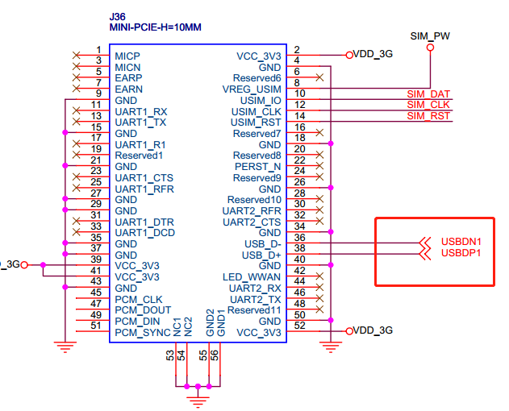

----------

#### RK3288 EC20 4G模块功能调试 ####

4/17/2020 10 :35 :15 AM  

Author：terrycoder

----------

**硬件环境：RP3288BV03开发板 **





可以看到EC20模块使用的是USB接口，所以可以在设备树中配置USB功能：

```

	usb_control {
		compatible = "rockchip,rk3288-usb-control";

//		host_drv_gpio = <&gpio0 GPIO_B6 GPIO_ACTIVE_LOW>;
		otg_drv_gpio = <&gpio0 GPIO_B4 GPIO_ACTIVE_LOW>;

		rockchip,remote_wakeup;
		rockchip,usb_irq_wakeup;
	};
};

```

**内核配置**


- 进入内核源码目录


	cd kernel/

	make menuconfig
	
	[*]Device Drivers →
		[*]USB Support →
			[*]USB Serial Converter support →
				[*]USB driver for GSM and CDMA modems

- 在driver/usb/serial/option.c路径文件下添加 EC20 Vendor ID 和Product ID


	static const struct usb_device_id option_ids[] = {
	//added by rpdzkj ivy for 3G 2015.11.6
	{ USB_DEVICE(0x19d2, 0x0199) },
	{ USB_DEVICE(0x05C6, 0x9090) },  //for UC15
	{ USB_DEVICE(0x05C6, 0x9003) },  //for UC20
	{ USB_DEVICE(0x05C6, 0x9215) },  //for EC20	
	{ USB_DEVICE(0x2c7c, 0x0125) },	 //for EC20 new version

**USB UG95驱动配置**


	[*]Device Drivers →
		[*]USB Support →
			[*]USB Modem (CDC ACM) support

**PPP 内核配置**

	Device Drivers --->
		[*] Network device support --->
			<*> PPP (point-to-point protocol) support
			<*> PPP support for async serial ports
			<*> PPP support for sync tty ports
			<*> PPP Deflate compression

**复制RIL驱动**

EC20提供的驱动包Driver package/reference-ril 复制到Android源码路径下/hardware/ril/下，然后重新编译安卓源码，编译完成后会在out/target/product/rk3288_box/system路径下生成以下四个文件：

	lib/libreference-ril.so
	etc/ppp/init.quectel-pppd
	etc/ppp/ip-up
	etc/ppp/ip-down

**系统配置**

为了使RIL驱动正常使用，还需要修改一些android配置文件。

**init.rc配置**

在init.rc文件中添加service "ril-daemon" 和 "ppp_gprs"两个服务：

	service ril-daemon /system/bin/rild -l /system/lib/libreference-ril.so
		class main
		socket rild stream 660 root radio
		socket rild-debug stream 666 radio system
		user root
		group radio cache inet misc audio sdcard_rw log


	service quectel-pppd /etc/ppp/init.quectel-pppd
		class main
		user root
		group radio cache inet misc log
		disabled
		oneshot

**注意：init.rc文件可能根据不同的工程存在于不同的路径比如:**

- system/core/rootdir/init.rc
- device/fsl/imx6/init.rc
- device/ti/am335xevm_sk/init.am335xevm.rc
- device/generic/x86/init.rc
- device/samsung/smdkv210/init.smdkv210_sdmmc.rc


**修改RILD权限**

RILD (ril-daemon)需要root权限，所以需要注释/hardwarer/ril/rild/rild.c文件中switchUser()

	OpenLib:
	#endif
	//switchUser();
	dlHandle = dlopen(rilLibPath, RTLD_NOW)