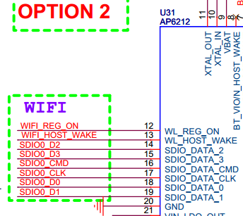
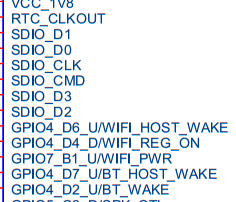
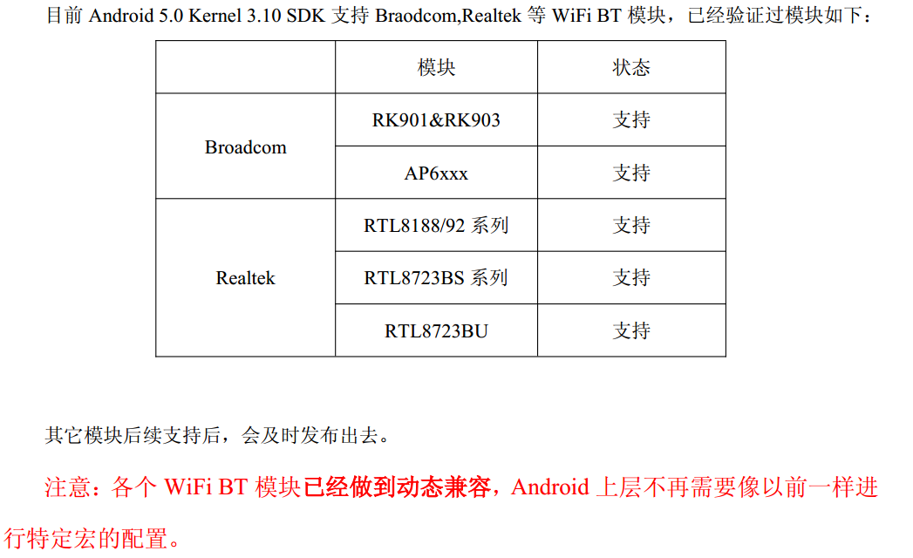

----------

#### RK3288 WIFI芯片 AP6212配置 ####

4/16/2020 10 :30 :45 AM


----------

**硬件环境：RP3288BV03开发板 **

AP6212原理图如下：






源码设备树配置 kernel/arch/arm/boot/dts/rp-rk3288.dts

```

 wireless-wlan {
        compatible = "wlan-platdata";

	/* wifi_chip_type - wifi chip define
	* bcmwifi ==> like ap6xxx, rk90x;
	* rtkwifi ==> like rtl8188xx, rtl8723xx,rtl8812auv;
	* esp8089 ==> esp8089;
	* other   ==> for other wifi;
	*/
	//wifi_chip_type = "bcmwifi";
	wifi_chip_type = "ap6212";
	//wifi_chip_type = "ap6335";
        sdio_vref = <1800>; //1800mv or 3300mv

	//keep_wifi_power_on;
        //power_ctrl_by_pmu;
        power_pmu_regulator = "act_ldo3";
        power_pmu_enable_level = <1>; //1->HIGH, 0->LOW


        WIFI,poweren_gpio = <&gpio4 GPIO_D4 GPIO_ACTIVE_HIGH>;
        WIFI,host_wake_irq = <&gpio4 GPIO_D6 GPIO_ACTIVE_HIGH>;
        //WIFI,reset_gpio = <&gpio0 GPIO_A2 GPIO_ACTIVE_LOW>;

        status = "okay";
    };

```

根据RKXX_Android 5.0 Kernel 3.10不同WiFi BT芯片自动兼容版本配置说明V1.0.pdf可知，只需要指定：wifi_chip_type = "ap6212"，就可以动态配置wifi芯片型号。




目前 Android 5.0 Kernel 3.10 SDK 支持 Braodcom,Realtek 等 WiFi BT 模块，已经验证过模块如下：

 系列 | 模块| 状态
- | :-: | :-: | :-: | -:
Broadcom | RK903 | 支持| 
Broadcom | AP6xxx | 支持
Realtek | RTL8188/92| 支持
Realtek | RTL8723BS| 支持
Realtek | RTL8723BU| 支持


	wifi_chip_type = "bcmwifi";

用来确认 wifi 芯片型号，由于 ap6xxx, rtl8188eu, eps8089 驱动都编译进 kernel，需要使用这个变量来确认实际硬件使用的 wifi 型号。

	sdio_vref = <1800>; //1800mv or 3300mv

这个配置项配置 WiFi 模组的 IO 参考电压值(目前只针对 RK3288 平台，RK312x 平台此参数无作用)，根据实际硬件设计中提供给 WiFi 模组参考电压输入的电压值来进行设定，以 AP6210 为例，模组的IO参考电压输入脚是第22脚VDDIO，在配置WiFi DTS时需要量取这个脚的电压假设是1.8V，然后填入这个配置项 1800。参考电压设置错误会导致 WiFi 通信异常引起 WiFi 打不开或者工作不稳定。

	//keep_wifi_power_on;

这个配置项打开之后 wifi 模组将在内核启动过程中上电，并且一直保持上电状态，后续开关wifi 时不对模组电源进行控制，针对一些有此需求的 wifi 模组比如 rtl8723au 和 rtl8723bu 因为wifi 和 bt 共用电源因此一般情况下在内核启动时直接对其上电并一直保持上电状态，以保证 wifi和 bt 都能正常工作。此配置项默认情况下是关闭的。

	//power_ctrl_by_pmu;
	power_pmu_regulator = "act_ldo3";
	power_pmu_enable_level = <1>; //1->HIGH, 0->LOW

这个部分的配置项是关于 WiFi 电源控制，通常情况下 WiFi 电源控制是由主控的 GPIO 来进行，但是也有部分产品设计实用 PMU 来作为 WiFi 电源或者模拟 GPIO 来控制 WiFi 模组供电，如果是这种情况那么需要将“power_ctrl_by_pmu”打开，并在“power_pmu_regulator”中填入对应的 PMU输出口，以及有效电平“power_pmu_enable_level”

	//vref_ctrl_enable;
	//vref_ctrl_gpio = <&gpio0 GPIO_A2 GPIO_ACTIVE_HIGH>;
	vref_pmu_regulator = "act_ldo3";
	vref_pmu_enable_level = <1>; //1->HIGH, 0->LOW

这个部分的配置是对一些可控制 IO 参考电压开关的项目提供参考电影开关的设置。默认情况下是关闭的，具体功能是实现在模组不工作（模组上的所有功能芯片都不工作）的情况下切断 IO参考电压输出，以此来降低一定的系统功耗。这个是可选配置并非所有硬件都支持，也不是所有WiFi 模组都支持。

	WIFI,poweren_gpio = <&gpio4 GPIO_D4 GPIO_ACTIVE_HIGH>;

这个是最常用，或者一定会用到的配置项，也就是 WiFi 的电源控制 GPIO 口设定的位置，客户需要根据硬件原理图确认 WiFi 电源控制脚接到主控的哪个 GPIO 口，然后填入这个地方，以3288SDK 板为例，使用 AP6335，WiFi 电源控制是第 12 脚“WL_REG_ON”接到主控的 GPIO4D4，高电平有效，因此如上所述方式填入。rfkill-wlan.c 驱动中对这个脚的控制逻辑为：在开机 probe 时会去 disable，在打开 wifi时会去 enable，关闭 wifi 时会 disable。休眠唤醒时不做控制。

	WIFI,host_wake_irq = <&gpio4 GPIO_D6 GPIO_ACTIVE_HIGH>;

这个配置项是 WiFi 中断脚的配置，某些 WiFi 模组没有这个脚可以不用配置直接将此配置项注释掉。使用 Broadcom 的 WiFi 比如 AP6xxx 以及 RK90x 等模组都需要正确配置这 GPIO。

Broadcom wifi AP6xxx 系统会使用此中断脚作为 wifi 数据中断脚，此中断脚有异常将会导致WiFi 无法正常工作。其它 WiFi，例如 RTL8723BS，在机器进入休眠时，如果有 WiFi 数据到来时此中断用来唤醒机器。此中断脚有异常并不会造成 WiFi 无法正常工作。

	//WIFI,reset_gpio = <&gpio0 GPIO_A2 GPIO_ACTIVE_LOW>;

这个配置项是预留的，某些 WiFi 模组具备 RESET 脚，需要配置。目前 Broadcom 的 WiFi 暂时都没有此功能脚，因此默认是注释掉的。rfkill-wlan.c 驱动中对这个脚的控制逻辑为：在开机 probe 时并不控制，在打开 wifi 时会去 enable，关闭 wifi 时会 disable。休眠唤醒时不做控制。


**蓝牙部分dts配置**

```
wireless-bluetooth {
        compatible = "bluetooth-platdata";

        //wifi-bt-power-toggle;

        uart_rts_gpios = <&gpio4 GPIO_C3 GPIO_ACTIVE_LOW>;
        pinctrl-names = "default","rts_gpio";
        pinctrl-0 = <&uart0_rts>;
        pinctrl-1 = <&uart0_rts_gpio>;

//        BT,power_gpio = <&gpio4 GPIO_D7 GPIO_ACTIVE_HIGH>;
        BT,reset_gpio = <&gpio4 GPIO_D5 GPIO_ACTIVE_HIGH>;
        BT,wake_gpio = <&gpio4 GPIO_D2 GPIO_ACTIVE_HIGH>;
        BT,wake_host_irq = <&gpio4 GPIO_D7 GPIO_ACTIVE_LOW>;

        status = "okay";
    };
```

	//wifi-bt-power-toggle;
这个配置项关于 WiFi 和 BT 共用一个电源控制的情况，例如 RealTek 的 RTL8723BU，WiFi 和BT 电源控制是同一个，而 Broadcom 的模组 WiFi 和 BT 的电源控制是分开的，因此默认这个配置是注释掉的。客户根据实际使用的模组进行配置。

	uart_rts_gpios = <&gpio4 GPIO_C3 GPIO_ACTIVE_LOW>;
	pinctrl-names = "default","rts_gpio";
	pinctrl-0 = <&uart0_rts>;
	pinctrl-1 = <&uart0_rts_gpio>;
这个部分的配置是关于 BT 的 uart 口 rts 脚的配置，部分型号的 BT 在操作过程中需要对 uart的 RTS 脚进行控制。例如 AP6210、AP6335 等。因此在使用这一类的 BT 模组时需要配置这个部分，默认情况下 uart 都是使用的 uart0，因此客户可以不需要修改这个部分，如果硬件设计将 BT 连接到其他的 uart 口则需要配置此部分到对应的内容。

	BT,power_gpio = <&gpio4 GPIO_D3 GPIO_ACTIVE_HIGH>;

这个配置项是关于 BT 的电源控制 GPIO 配置，以 3288 SDK 板为例，AP6335 BT 的电源控制口是第 34 脚 BT_REG_ON 连接到的主控 GPIO 口是 GPIO4D3，高电平有效。rfkill-bt.c 驱动中对这个脚的控制逻辑为：在开机 probe 时会去 disable，在打开 bt 时会去 enable，关闭 bt 时会 disable。休眠唤醒时不做控制。

	BT,reset_gpio = <&gpio4 GPIO_D5 GPIO_ACTIVE_HIGH>;

这个配置项是关于 BT 的 RESET 脚配置，这个脚不同的 BT 模组不一定都有，具体以实际原理图为准。rfkill-bt.c 驱动中对这个脚的控制逻辑为：在开机 probe 时会去 disable，在打开 bt 时会去 enable，关闭 bt 时会 disable。休眠唤醒时不做控制。

	BT,wake_gpio = <&gpio4 GPIO_D2 GPIO_ACTIVE_HIGH>;

这个配置项是关于 BT 的 WAKE 脚配置，以 3288 SDK 板为例，AP6335 BT 的 WAKE 脚是第 6 脚BT_WAKE 连接到的主控 GPIO 口是 GPIO4D2，高电平有效。rfkill-bt.c 驱动中对这个脚的控制逻辑为：在 bt 空闭时，通过 disable 它来让 bt 进入低功
耗模式。

	BT,wake_host_irq = <&gpio4 GPIO_D7 GPIO_ACTIVE_LOW>;

这个配置项是关于 BT 的中断脚配置，以 3288 SDK 板为例，AP6335 BT 的中断脚是第 6 脚 BT_WAKE连接到的主控 GPIO 口是 GPIO4D2，高电平有效。rfkill-bt.c 驱动中对这个脚的控制逻辑为：在机器进入休眠时，如果有 bt 数据到来时此中
断用来唤醒机器。

**SDIO 相关配置**

```
&sdio {
		clock-frequency = <50000000>;
		clock-freq-min-max = <200000 50000000>;
		supports-highspeed;
		supports-sdio;
		ignore-pm-notify;
		keep-power-in-suspend;
		//cap-sdio-irq;
		status = "okay";
};

```

**UART 相关配置**

BT 一般使用 UART 接口，所以在 dts 中需要配置相应 uart dts，可以从公板的 dts 拷贝过来

	&uart_bt {
        status = "okay";
        dma-names = "!tx", "!rx";
        pinctrl-0 = <&uart0_xfer &uart0_cts>;
	};

默认 UART Clock 是 24M，可以让稳定工作在 1.5M 的波特率下。如果需要修改其它波特率，
请按以下公式计算出相应的 Clock：clock = n * 16 * rate (n = 1, 2, ...),例如调试波特别率为 3M，那么 clock 需要设置为 48M。