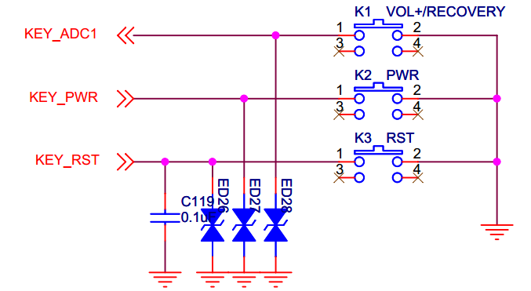
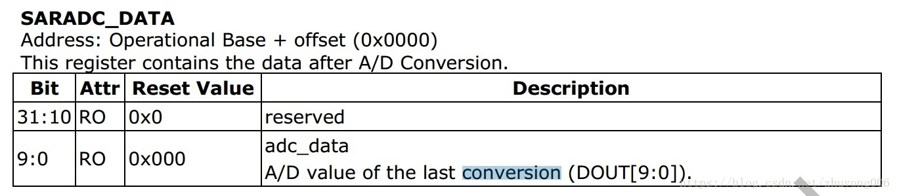

----------
#### RK3288 ADC按键源码解析 ####

3/19/2020 9 :41 :45 AM 

Author :terrycoder 

----------

### 查看设备原理图ADC对应的管脚 ###

开发板原理图如下：

可以看出开发板KEY_ADC1使用的是ADC1，精度方面，从rk3288 datasheet得知，采样精度是10位

在设备树文件夹**kernel/arch/arm/boot/dts/rpdzkj_config.dtsi** 路径下配置设备树

	&adc {
		status = "okay";
	
		key {
			compatible = "rockchip,key";
			
			io-channels = <&adc 1>; //ADC口配置为 adc1
			/*
			vol-up-key {
				linux,code = <115>;
				label = "volume up";
				rockchip,adc_value = <1>; 
			};
	
			vol-down-key {
				linux,code = <114>;
				label = "volume down";
				rockchip,adc_value = <170>;
			};
			*/
			power-key {
				gpios = <&gpio0 GPIO_A5 GPIO_ACTIVE_LOW>;
				linux,code = <116>;		
				label = "power";
				gpio-key,wakeup;
			};
			recovery-key {
				linux,code = <113>;		//配置 Linux 上按键码
				label = "recovery";
				rockchip,adc_value = <4>; //adc	值为4
			};
		};
	};

其中linux,code按键码可以参考 \kernel\include\uapi\linux\input.h 里定义的键值码信息。

label：描述值，可以简单说明一下这个按键的功能。没太大意义，一般用于在打印上打印一些易于区分的标识符。
rockchip,adc_value：adc的转化数值，也就是AD采集到的原始数值。

注意：这里的KEY_PWR不是adc接口按键，是接的gpio按键。rk3288 标准电压Vref为1.8V。

### rk3288 ADC驱动源码 ###

文件路径：**kernel\drivers\input\keyboard\rk_keys.c**

- **keys_probe设备匹配**

	static int keys_probe(struct platform_device *pdev)
	{
		struct device *dev = &pdev->dev;
		struct device_node *np = pdev->dev.of_node;
		struct rk_keys_drvdata *ddata = NULL;
		struct input_dev *input = NULL;
		int i, error = 0;
		int wakeup, key_num = 0;
	
		key_num = of_get_child_count(np);  //获取设备树定义的按键数量
		if (key_num == 0)
			dev_info(&pdev->dev, "no key defined\n");
	
		ddata = devm_kzalloc(dev, sizeof(struct rk_keys_drvdata) +
				     key_num * sizeof(struct rk_keys_button),
				     GFP_KERNEL);
	
		input = devm_input_allocate_device(dev); 
		if (!ddata || !input) {
			error = -ENOMEM;
			return error;
		}
		platform_set_drvdata(pdev, ddata); //将私有数据与平台设备绑定
	
		//初始化输入设备
		input->name = "rk29-keypad";	/* pdev->name; */
		input->phys = "gpio-keys/input0";
		input->dev.parent = dev;
	
		input->id.bustype = BUS_HOST;
		input->id.vendor = 0x0001;
		input->id.product = 0x0001;
		input->id.version = 0x0100;
		ddata->input = input;
	
		/* parse info from dt */
		ddata->nbuttons = key_num;
		error = rk_keys_parse_dt(ddata, pdev); //获取adc采集值，解析设备树按键资源
		if (error)
			goto fail0;
	
		/* Enable auto repeat feature of Linux input subsystem */
		if (ddata->rep)
			__set_bit(EV_REP, input->evbit);
	
		for (i = 0; i < ddata->nbuttons; i++) {
			struct rk_keys_button *button = &ddata->button[i];
	
			if (button->code) { //存在code值则开启定时器
				setup_timer(&button->timer,
					    keys_timer, (unsigned long)button);
			}
	
			if (button->wakeup)
				wakeup = 1;
	
			input_set_capability(input, EV_KEY, button->code); // 设置按键功能 button->code 为113
		}
	
		wake_lock_init(&ddata->wake_lock, WAKE_LOCK_SUSPEND, input->name); // 初始化内核休眠锁 WAKE_LOCK_SUSPEND阻止进入深度休眠模式  
	
		for (i = 0; i < ddata->nbuttons; i++) {
			struct rk_keys_button *button = &ddata->button[i];
	
			if (button->type == TYPE_GPIO) {
				int irq;
	
				error =
				    devm_gpio_request(dev, button->gpio,
						      button->desc ? : "keys"); 	//申请goio资源
				if (error < 0) {
					pr_err("gpio-keys: failed to request GPIO %d, error %d\n",
					       button->gpio, error);
					goto fail1;
				}
	
				error = gpio_direction_input(button->gpio);  //设置gpio为输入模式
				if (error < 0) {
					pr_err("gpio-keys: failed to configure input direction for GPIO %d, error %d\n",
					       button->gpio, error);
					gpio_free(button->gpio);
					goto fail1;
				}
	
				irq = gpio_to_irq(button->gpio); //获取gpio中断号
				if (irq < 0) {
					error = irq;
					pr_err("gpio-keys: Unable to get irq number for GPIO %d, error %d\n",
					       button->gpio, error);
					gpio_free(button->gpio);
					goto fail1;
				}
	
				error = devm_request_irq(dev, irq, keys_isr,
							 button->active_low ?
							 IRQF_TRIGGER_FALLING :
							 IRQF_TRIGGER_RISING,
							 button->desc ?
							 button->desc : "keys",
							 button); 		//申请中断
				if (error) {
					pr_err("gpio-keys: Unable to claim irq %d; error %d\n",
					       irq, error);
					gpio_free(button->gpio);
					goto fail1;
				}
			}
		}
	
		input_set_capability(input, EV_KEY, KEY_WAKEUP);	// 设置按键功能为 KEY_WAKEUP
		device_init_wakeup(dev, wakeup);		//配置设备唤醒状态
	
		error = input_register_device(input);	//注册按键设备
		if (error) {
			pr_err("gpio-keys: Unable to register input device, error: %d\n",
			       error);
			goto fail2;
		}
	
		/* adc polling work */
		if (ddata->chan) {
			INIT_DELAYED_WORK(&ddata->adc_poll_work, adc_key_poll); //初始化延时工作队列
			schedule_delayed_work(&ddata->adc_poll_work,
					      ADC_SAMPLE_JIFFIES); //延迟ADC_SAMPLE_JIFFIES 后添加工作队列
		}
	
		spdata = ddata; //赋全局变量值
		sinput_dev = input;
		return error;
	
	fail2:
		device_init_wakeup(dev, 0);
	fail1:
		wake_lock_destroy(&ddata->wake_lock);
		while (--i >= 0)
			del_timer_sync(&ddata->button[i].timer);
	fail0:
		platform_set_drvdata(pdev, NULL);
	
		return error;
	}

- **rk_keys_parse_dt解析adc设备树**

	static int rk_keys_parse_dt(struct rk_keys_drvdata *pdata,
				    struct platform_device *pdev)
	{
		struct device_node *node = pdev->dev.of_node;
		struct device_node *child_node;
		struct iio_channel *chan;
		int ret, gpio, i = 0;
		u32 code, adc_value, flags;
	
		chan = iio_channel_get(&pdev->dev, NULL);  // 获取采集到的adc值
		if (IS_ERR(chan)) {
			dev_info(&pdev->dev, "no io-channels defined\n");
			chan = NULL;
		}
		pdata->chan = chan;
	
		for_each_child_of_node(node, child_node) { // 遍历所有adc按键子节点
			if (of_property_read_u32(child_node, "linux,code", &code)) {
				dev_err(&pdev->dev,
					"Missing linux,code property in the DT.\n");
				ret = -EINVAL;
				goto error_ret;
			}
			pdata->button[i].code = code;	// 读取linux 按键值
			pdata->button[i].desc =
			    of_get_property(child_node, "label", NULL); //获取设备树按键描述 label
			pdata->button[i].type =
			    rk_key_type_get(child_node, &pdata->button[i]); // 获取子节点按键类型，将结果存入pdata->button的type中
			switch (pdata->button[i].type) { //判断按键类型
			case TYPE_GPIO:
				gpio = of_get_gpio_flags(child_node, 0, &flags); //从设备树中获取gpio资源，将有效值存入flags
				if (gpio < 0) {
					ret = gpio;
					if (ret != -EPROBE_DEFER)
						dev_err(&pdev->dev,
							"Failed to get gpio flags, error: %d\n",
							ret);
					goto error_ret;
				}
	
				pdata->button[i].gpio = gpio;	// 填充私有数据
				pdata->button[i].active_low =
				    flags & OF_GPIO_ACTIVE_LOW;
				pdata->button[i].wakeup =
				    !!of_get_property(child_node, "gpio-key,wakeup",
						      NULL);  //判断是否定义 gpio-key,wakeup 返回 1
				break;
	
			case TYPE_ADC:
				if (of_property_read_u32
				    (child_node, "rockchip,adc_value", &adc_value)) { //获取设备树中adc值
					dev_err(&pdev->dev,
						"Missing rockchip,adc_value property in the DT.\n");
					ret = -EINVAL;
					goto error_ret;
				}
				pdata->button[i].adc_value = adc_value;
				break;
	
			default:
				dev_err(&pdev->dev,
					"Error rockchip,type property in the DT.\n");
				ret = -EINVAL;
				goto error_ret;
			}
			i++;
		}
	
		return 0;
	
	error_ret:
		return ret;
	}

- **rk_key_type_get 返回按键类型**

	static int rk_key_type_get(struct device_node *node,
				   struct rk_keys_button *button)
	{
		u32 adc_value;
	
		if (!of_property_read_u32(node, "rockchip,adc_value", &adc_value)) //获取设备树中adc值，如果获取到adc值 返回按键类型为adc
			return TYPE_ADC;
		else if (of_get_gpio(node, 0) >= 0)	//获取设备树中gpio值，如果获取到gpio， 返回按键类型为gpio
			return TYPE_GPIO;
		else
			return -1;
	}

- **void keys_timer定时器回调函数**

	static struct input_dev *sinput_dev;
	static struct rk_keys_drvdata *spdata;
	
	static void *rk_key_get_drvdata(void)
	{
		BUG_ON(!spdata);
		return spdata;
	}

	static void keys_timer(unsigned long _data)
	{
		struct rk_keys_drvdata *pdata = rk_key_get_drvdata();
		struct rk_keys_button *button = (struct rk_keys_button *)_data;
		struct input_dev *input = pdata->input;
		int state;
	
		if (button->type == TYPE_GPIO)  //判断按键类型
			state = !!((gpio_get_value(button->gpio) ? 1 : 0) ^
				   button->active_low);  //翻转state状态
		else
			state = !!button->adc_state;
	
		if (button->state != state) { //按键状态发生改变
			button->state = state;
			input_event(input, EV_KEY, button->code, button->state);
			key_dbg(pdata, "%skey[%s]: report event[%d] state[%d]\n",
				button->type == TYPE_ADC ? "adc" : "gpio",
				button->desc, button->code, button->state);
			input_event(input, EV_KEY, button->code, button->state); //上报按键值
			input_sync(input);
		}
	
		if (state)
			mod_timer(&button->timer, jiffies + DEBOUNCE_JIFFIES); //按键一直没有抬起就不断重启定时器
	}

- **adc_key_poll adc按键值获取轮询**

	static void adc_key_poll(struct work_struct *work)
	{
		struct rk_keys_drvdata *ddata;
		int i, result = -1;
	
		ddata = container_of(work, struct rk_keys_drvdata, adc_poll_work.work);
		if (!ddata->in_suspend) {	//没有休眠
			result = rk_key_adc_iio_read(ddata);	//读取adc值
			if (result > INVALID_ADVALUE && result < EMPTY_ADVALUE) //判断返回adc值是否有效
				ddata->result = result;			
			for (i = 0; i < ddata->nbuttons; i++) {
				struct rk_keys_button *button = &ddata->button[i];
	
				if (!button->adc_value)  //adc值为0 跳过当前循环
					continue;
				if (result < button->adc_value + DRIFT_ADVALUE &&
				    result > button->adc_value - DRIFT_ADVALUE) //判断是否在有效adc值范围内
					button->adc_state = 1;
				else
					button->adc_state = 0;
				if (button->state != button->adc_state) //松开按键后重新开始计时器
					mod_timer(&button->timer,
						  jiffies + DEBOUNCE_JIFFIES);
			}
		}
	
		schedule_delayed_work(&ddata->adc_poll_work, ADC_SAMPLE_JIFFIES); //开启延时工作队列
	}

- **keys_isr中断函数**

	static irqreturn_t keys_isr(int irq, void *dev_id)
	{
		struct rk_keys_drvdata *pdata = rk_key_get_drvdata();
		struct rk_keys_button *button = (struct rk_keys_button *)dev_id;
		struct input_dev *input = pdata->input;
	
		BUG_ON(irq != gpio_to_irq(button->gpio));
	
		if (button->wakeup && pdata->in_suspend) {
			button->state = 1;
			key_dbg(pdata,
				"wakeup: %skey[%s]: report event[%d] state[%d]\n",
				(button->type == TYPE_ADC) ? "adc" : "gpio",
				button->desc, button->code, button->state);
			input_event(input, EV_KEY, button->code, button->state);
			input_sync(input);
		}
		if (button->wakeup)
			wake_lock_timeout(&pdata->wake_lock, WAKE_LOCK_JIFFIES);
		mod_timer(&button->timer, jiffies + DEBOUNCE_JIFFIES);
	
		return IRQ_HANDLED;
	}