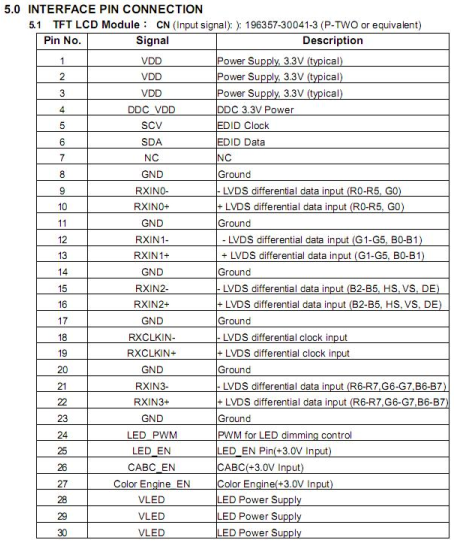
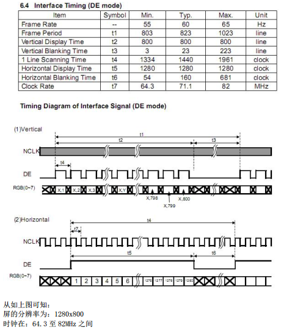
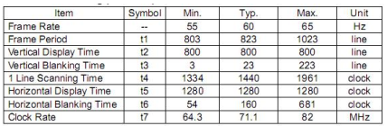

----------
**RK3288 平台 LCD 调试说明**

3/17/2020 10 :30 :59 AM 

Author：terrycoder

----------

### 1.3288 开发板支持 LCD 屏的接口类型 ###

支持 LVDS， MIPI， EDP

### 2.调试 LCD 屏相关的说明： ###

**路径： kernel/arch/arm/boot/dts/rp-rk3288.dts**

在如上的 dts 文件中包含了许多 dtsi 文件， 分别对应了许多类型屏的配置在调试屏的过程中， 可通过这些屏相关的 dtsi 文件来进行配置调试不同的屏以及不同的开发平台相应的参数都会有差异.

### 3. LVDS 调试参数说明： ###

在 LVDS 屏相关的 dtsi 文件中会有如下配置：

	disp_timings: display-timings {
		native-mode = <&timing0>;
		timing0: timing0 {
		//屏的类型， lvds
		//参考： 6.屏对应的各个参数的类型配置
		screen-type = <SCREEN_LVDS>;
		//lvds 屏的格式
		lvds-format = <LVDS_8BIT_2>;
		//输出的数据类型（屏幕 pixel format ）
		out-face = <OUT_D888_P666>;
		//颜色模式
		color-mode = <COLOR_RGB>;
		//时钟
		clock-frequency = <45000000>;
		//水平有效像素
		hactive = <1024>;
		//垂直有效像素
		vactive = <600>;
		//hbp
		hback-porch = <160>;
		//hfp
		hfront-porch = <160>;
		//vbp
		vback-porch = <23>;
		//vfp
		vfront-porch = <12>;
		//h-sync
		hsync-len = <20>;
		//v-sync
		vsync-len = <3>;
		//下面几个参数基本上不需要变化,除非屏显示有异常.
		hsync-active = <0>;
		vsync-active = <0>;
		de-active = <0>;
		pixelclk-active = <1>;
		swap-rb = <0>;
		swap-rg = <0>;
		swap-gb = <0>;
		ddr-change-notify-screen = <0>;
		};
	};

### 4. MIPI 调试参数说明 ###

在 MIPI 屏相关的 dtsi 文件中会有如下配置:

	disp_mipi_init: mipi_dsi_init{
		compatible = "rockchip,mipi_dsi_init";
		//屏幕是否需要初始化
		rockchip,screen_init = <1>;
		//有几条 Lane
		rockchip,dsi_lane = <2>;
		//dsi 的时钟， 范围大约在 90~1500MHz
		rockchip,dsi_hs_clk = <900>;
		//单 MIPI 还是双 MIPI (单 MIPI 是 1， 双 MIPI 是 2)
		rockchip,mipi_dsi_num = <1>;
		};
	//上电时序
	disp_mipi_power_ctr: mipi_power_ctr { //使能脚控制
		compatible = "rockchip,mipi_power_ctr";
		mipi_lcd_en:mipi_lcd_en {
		compatible = "rockchip,lcd_en";
		//使能脚对应的 GPIO
		//GPIO_ACTIVE_HIGH： 高电平
		//GPIO_ACTIVE_LOW： 低电平
		rockchip,gpios = <&gpio7 GPIO_A2 GPIO_ACTIVE_HIGH>;
		rockchip,delay = <10>; //延时
		};
	mipi_lcd_rst:mipi_lcd_rst{ //复位脚控制
		compatible = "rockchip,lcd_rst";
		//复位脚对应的 GPIO
		//GPIO_ACTIVE_HIGH： 高电平
		//GPIO_ACTIVE_LOW： 低电平
		rockchip,gpios = <&gpio7 GPIO_A3 GPIO_ACTIVE_HIGH>;
		rockchip,delay = <200>; //延时
		};
	};
	disp_mipi_init_cmds: screen-on-cmds {
		rockchip,cmd_debug = <0>;
		compatible = "rockchip,screen-on-cmds";
		rockchip,on-cmds1 {
		compatible = "rockchip,on-cmds";
		//一般都是 LPDT
		rockchip,cmd_type = <LPDT>;
		//用的哪个通道 dsi
		rockchip,dsi_id = <0>;
		//mipi 对应初始化数据： type， cmd， data
		rockchip,cmd = <0x39 0xFE 0x01>;
		//初始化 mipi 命令的延时
		rockchip,cmd_delay = <0>;
		..................................................
	rockchip,on-cmds198 {
		compatible = "rockchip,on-cmds";
		rockchip,cmd_type = <LPDT>;
		rockchip,dsi_id = <0>;
		rockchip,cmd = <0x39 0xFE 0x00>;
		rockchip,cmd_delay = <0>;
		};
	//11 29 命令
	rockchip,on-cmds199 {
		compatible = "rockchip,on-cmds";
		rockchip,cmd_type = <LPDT>;
		rockchip,dsi_id = <0>;
		rockchip,cmd = <0x05 0x11>;
		rockchip,cmd_delay = <120>;
	};
	rockchip,on-cmds200 {
		compatible = "rockchip,on-cmds";
		rockchip,cmd_type = <LPDT>;
		rockchip,dsi_id = <0>;
		rockchip,cmd = <0x05 0x29>;
		rockchip,cmd_delay = <120>;
		};
	};
	disp_timings: display-timings {
		native-mode = <&timing0>;
		timing0: timing0 {
		//屏的类型， mipi
		//参考： 6.屏对应的各个参数的类型配置
		screen-type = <SCREEN_MIPI>;
		lvds-format = <LVDS_8BIT_2>;、
		//输出的数据类型（屏幕 pixel format ）
		out-face = <OUT_P888>;
		//时钟
		clock-frequency = <65000000>;
		//水平有效像素
		hactive = <720>;
		//垂直有效像素
		vactive = <1280>;
		//h-sync
		hsync-len = <8>;
		//hbp
		hback-porch = <64>;
		//hfp
		hfront-porch = <64>;
		//v-sync
		vsync-len = <4>;
		//vbp
		vback-porch = <16>;
		//hfp
		vfront-porch = <16>;
		//下面几个参数基本上不需要变化,除非屏显示有异常.
		hsync-active = <0>;
		vsync-active = <0>;
		de-active = <0>;
		pixelclk-active = <0>;
		swap-rb = <0>;
		swap-rg = <0>;
		swap-gb = <0>;
		ddr-change-notify-screen = <0>;
		};
	};

### 4.1 MIPI 命令的数据类型的使用 ###

命令用 05
单个参数用 15 或 39
多个参数用 39
如上的类型使用是一般情况下的使用方法， 但是用户需要按照手册提供的配置进行配置是最为合理的。

### 5. EDP 调试参数说明 ###

在 EDP 屏相关的 dtsi 文件中会有如下配置:

	disp_timings: display-timings {
		native-mode = <&timing1>;
		timing0: timing0 {
		//屏的类型， edp
		//参考： 6.屏对应的各个参数的类型配置
		screen-type = <SCREEN_EDP>;
		//输出的数据类型（屏幕 pixel format ）
		out-face = <OUT_P666>;
		//时钟
		clock-frequency = <135000000>;
		//水平有效像素
		hactive = <1920>;
		//垂直有效像素
		vactive = <1080>;
		//hbp
		hback-porch = <20>;
		//hfp
		hfront-porch = <20>;
		//vbp
		vback-porch = <20>;
		//vfp
		vfront-porch = <12>;
		//h-sync
		hsync-len = <20>;
		//v-sync
		vsync-len = <3>;
		//下面几个参数基本上不需要变化,除非屏显示有异常.
		hsync-active = <0>;
		vsync-active = <0>;
		de-active = <0>;
		pixelclk-active = <0>;
		swap-rb = <0>;
		swap-rg = <0>;
		swap-gb = <0>;
		ddr-change-notify-screen = <0>;
		};
	};

### 6. 屏对应的各个参数的类型配置 ###

**路径： kernel/include/dt-bindings/rkfb/rk_fb.h**

	screen-type:
	#define SCREEN_NULL 0
	#define SCREEN_RGB 1
	#define SCREEN_LVDS 2
	#define SCREEN_DUAL_LVDS 3
	#define SCREEN_MCU 4
	#define SCREEN_TVOUT 5
	#define SCREEN_HDMI 6
	#define SCREEN_MIPI 7
	#define SCREEN_DUAL_MIPI 8
	#define SCREEN_EDP 9
	#define SCREEN_TVOUT_TEST 10
	#define SCREEN_LVDS_10BIT 11
	#define SCREEN_DUAL_LVDS_10BIT 12
	out-face:
	#define OUT_P888 0 //24bit screen,connect to lcdc D0~D23
	#define OUT_P666 1 //18bit screen,connect to lcdc D0~D17
	#define OUT_P565 2
	#define OUT_S888x 4
	#define OUT_CCIR656 6
	#define OUT_S888 8
	#define OUT_S888DUMY 12
	#define OUT_YUV_420 14
	#define OUT_P101010 15
	#define OUT_YUV_420_10BIT 16
	#define OUT_P16BPP4 24
	#define OUT_D888_P666 0x21 //18bit screen,connect to lcdc D2~D7, D10~D15,
	D18~D23
	#define OUT_D888_P565 0x22
	lvds-format:
	#define LVDS_8BIT_1 0
	#define LVDS_8BIT_2 1
	#define LVDS_8BIT_3 2
	#define LVDS_6BIT 3
	#define LVDS_10BIT_1 4
	#define LVDS_10BIT_2 5

### 7. 通过规格书进行屏相关的参数配置 ###

通过如下规格书的部分截图举例说明:

从如上图片汇总的接口定义可以看到该LCD为LVDS类型。

查看 LCD 手册的时序

如上图所示：
修改时序与时钟需要注意的是， 我们一般调试会先选择 Typ 里的作为调试基础

### 8. LCD 调试过程中遇到的问题 ###

调试 LCD 之前， 必须要保证 LCD 屏的 IO 脚与原理图中屏相关的 IO 脚正确对应。

**1>不亮背光**
检查当前的背光脚状态是否正确
**2>只亮背光**
检查屏的供电，复位脚等 IO 脚电位是否正确
检查 LCD 的时钟、上电时序、 分辨率等参数是否正确
若是 MIPI 屏，且如上都没有问题，联系屏厂 FAE，确认 MIPI初始化数据是否有问题
**3>花屏**
检查屏的上电时序、 时钟等参数是否正确
**4>显示颜色异常**
检查屏的时钟相关参数的配置是否正确
**5>屏偏**
检查屏的前沿、 后沿等参数是否正确，若是 MIPI 屏， 则必须要保证 MIPI初始化命令是正确的，如上的配置需要参数屏对应的手册进行参数的配置