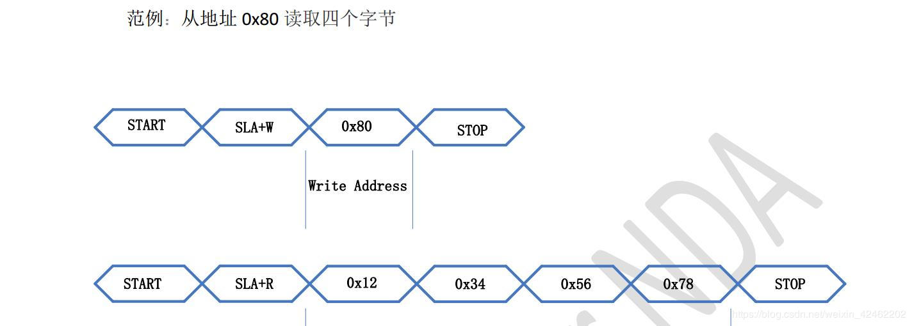

----------
#### RK3288 驱动开发常用API ####

3/24/2020 1 :26 :15 PM 

Author :terrycoder 

----------

### GOIO接口 ###

	int gpio_request(unsigned gpio, const char *label) //申请gpio资源
	void gpio_free(unsigned gpio)						//释放gpio资源
	int gpio_direction_input(unsigned gpio)				//设置gpio为输入模式
	int gpio_direction_output(unsigned gpio, int value)	//设置gpio为输出模式
	int __gpio_get_value(unsigned gpio)					//获取gpio管脚电平状态
	void __gpio_set_value(unsigned gpio, int value)		//设置gpio电平
	int __gpio_to_irq(unsigned gpio)					//由gpio管脚获取中断号

	int devm_gpio_request(struct device *dev, unsigned gpio, const char *label) //申请设备管理gpio
	void devm_gpio_free(struct device *dev, unsigned int gpio)					//释放设备管理gpio

### OF接口 ###

	static inline struct device_node *of_find_node_by_name(struct device_node *from,
		const char *name)//在设备树中查找节点

	static inline const void *of_get_property(const struct device_node *node,
				const char *name,
				int *lenp)//在设备树中查找属性

	static inline bool of_property_read_bool(const struct device_node *np,
					 const char *propname)

	static inline int of_property_read_u8(const struct device_node *np,
				       const char *propname,
				       u8 *out_value)

	static inline int of_property_read_u16(const struct device_node *np,
				       const char *propname,
				       u16 *out_value)

	static inline int of_property_read_u32(const struct device_node *np,
				       const char *propname,
				       u32 *out_value)//在设备树中读取32位字节数据

	int of_get_named_gpio_flags(struct device_node *np, const char *propname,
			   int index, enum of_gpio_flags *flags) //在设备树中查找gpio

### Input输入子系统 ###

	int input_register_device(struct input_dev *dev) //注册一个输入设备

	void input_unregister_device(struct input_dev *dev) //释放一个输入设备

	void input_set_capability(struct input_dev *dev, unsigned int type, unsigned int code) //设置按键设备类型和按键值 内部调用__set_bit()

	static inline void input_report_key(struct input_dev *dev, unsigned int code, int value) //上报一个按键事件，内部调用input_event()

	void input_event(struct input_dev *dev,
		 unsigned int type, unsigned int code, int value) //创建一个输入事件

	static inline void input_sync(struct input_dev *dev) //内部调用input_event()

	__set_bit(EV_REP, input->evbit); //位操作设置按键属性

	struct input_dev *devm_input_allocate_device(struct device *dev) // 实际内部调用input_allocate_device
	
	struct input_dev *input_allocate_device(void) //申请按键设备

	void input_free_device(struct input_dev *dev); //释放按键设备

	

### I2C 接口 ###

**一、I2C驱动的注册**

1.设置I2C驱动

	static const struct i2c_device_id my_i2c_dev_id[] = {
		{ "my_i2c_dev", 0},  /* 设备名字 */
		{ }
	};
	 
	static struct i2c_driver my_i2c_drv = {
		.driver = {
			.name	= "no", /* 这个名字不重要 */
	        .owner = THIS_MODULE,
		},
		.probe		= my_i2c_drv_probe, /* 当匹配到i2c设备时调用 */
		.remove		= my_i2c_drv_remove, /* 当卸载i2c设备或驱动时调用 */
		.id_table	= my_i2c_dev_id, /* 这个结构体中的名字很重要 */
	};

其中的my_i2c_dev_id非常重要，数组元素中的名称指明了支持的I2C设备

要定义号probe函数和remove函数，注册时发现有设备和驱动匹配，probe函数会被调用，在卸载匹配的驱动或者设备的时候，remove函数会被调用

2.注册I2C驱动

通过i2c_add_driver来注册一个I2C驱动

	static int __init my_i2c_drv_init(void)
	{
	 
		i2c_add_driver(&my_i2c_drv_drv);
	 
		return 0;
	}

**二、I2C设备的注册**
注册I2C设备有多种方法，下面介绍三种

2.1 静态注册
静态注册表示只可以在内核启动时就讲i2c设备注册进内核

- 定义一个i2c_board_info对象

	static struct i2c_board_info  my_i2c_dev_info = {
		I2C_BOARD_INFO("my_i2c_dev", 0x2d), //名字，设备地址
	};

- 通过i2c_register_board_info注册

	/*
	 * busnum：哪一条总线，也就是选择哪一个i2c控制器
	 * info：i2c设备信息数组
	 * n：数组有几项
	 */
	i2c_register_board_info(int busnum, struct i2c_board_info const * info, unsigned n);

**2.2 动态注册**

动态注册可以在内核运行期间注册，也就是可以应用在加载驱动模块中

- 定义一个i2c_board_info对象

	static struct i2c_board_info  my_i2c_dev_info = {
		I2C_BOARD_INFO("my_i2c_dev", 0x2d), //名字，设备地址
	};

- 通过i2c_new_device来动态注册

	/*
	 * adap：指定i2c设备器，以后访问设备的时候，使用过哪一个设备器（i2c主机控制器）去访问
	 * info：指定i2c设备信息
	 */
	struct i2c_client *
	i2c_new_device(struct i2c_adapter *adap, struct i2c_board_info const *info);

**三、I2C数据传输**

I2C数据传输通过i2c_transfer

	/*
	 * adap：i2c适配器
	 * msgs：消息数据
	 * num：数组的个数
	 */
	int i2c_transfer(struct i2c_adapter *adap, struct i2c_msg *msgs, int num)

i2c_msg的定义如下

	struct i2c_msg {
		__u16 addr;	//从设备地址
		__u16 flags; //读或写
		__u16 len;	//消息的长度
		__u8 *buf;	//消息
	};

例如要发送下列的时序

	
	/* 定义 i2c_msg 结构体 */
	struct i2c_msg msg[2]; 
	 
	char val[10]
	 
	/* 填充msg */
	msg[0].addr = my_i2c_client->addr; /* 这个client在probe函数中得到的 */
	msg[0].flags = 0; /* 0表示写，1表示读 */
	msg[0].buf = 0x80; /* 写：要发送的数据地址，读：读取到的数据存放的地址 */
	msg[0].len = 1; /* 想要传输的字节数 */
	 
	/* 填充msg */
	msg[1].addr = my_i2c_client->addr; /* 这个client在probe函数中得到的 */
	msg[1].flags = 1; /* 1表示读 */
	msg[1].buf = val; /* 读到的数据存在这里 */
	msg[1].len = 4; /* 想要读取的字节数 */
	 
	 
	/* 传输数据 */
	i2c_transfer(my_i2c_client->adapter, msg, 2); /* 有两个msg */

**四、I2C驱动模板**

I2C设备

	#include <linux/kernel.h>
	#include <linux/module.h>
	#include <linux/platform_device.h>
	#include <linux/i2c.h>
	#include <linux/err.h>
	#include <linux/slab.h>
	 
	static struct i2c_board_info my_i2c_dev_info = {
	    I2C_BOARD_INFO("my_i2c_dev", 0x50), /* 这个名字和地址很重要 */
	};
	 
	static struct i2c_client *my_i2c_client;
	 
	static int i2c_dev_init(void)
	{
	    struct i2c_adapter *i2c_adap;
	 
	    i2c_adap = i2c_get_adapter(0); /* 得到i2c设备器，i2c设备在哪条总线上 */
	    my_i2c_client = i2c_new_device(i2c_adap, &my_i2c_dev_info);
	    i2c_put_adapter(i2c_adap);
	 
	    return 0;
	}
	 
	static void i2c_dev_exit(void)
	{ 
	    i2c_unregister_device(my_i2c_client);
	}
	 
	module_init(i2c_dev_init);
	module_exit(i2c_dev_exit);
	MODULE_LICENSE("GPL");

I2C驱动

	#include <linux/module.h>
	#include <linux/init.h>
	#include <linux/fs.h>
	#include <linux/device.h>
	#include <asm/uaccess.h>
	#include <linux/i2c.h>
	#include <linux/input.h>
	#include <linux/earlysuspend.h>
	#include <linux/interrupt.h>
	#include <linux/delay.h>
	#include <linux/gpio.h>
	#include <linux/irq.h>
	#include <linux/ioc4.h>
	#include <linux/io.h>
	 
	#include <linux/proc_fs.h>
	 
	#include <mach/gpio.h>
	#include <mach/hardware.h>
	#include <plat/gpio-cfg.h>
	#include <plat/irqs.h>
	 
	 
	static struct i2c_client *my_i2c_client;
	 
	static const struct i2c_device_id my_i2c_dev_id[] = {
		{ "my_i2c_dev", 0 },
		{ }
	};
	 
	static int my_i2c_drv_probe(struct i2c_client *client,
				const struct i2c_device_id *id)
	{
	    /* 记录下i2c设备client */
	    my_i2c_client = client;    
	 
	    /* 在这里注册字符设备，创建设备节点 */
	    
	    /* 这里为了简单，只是打印一句话而已 */
	    printk("my_i2c_ddrv_probe\n");
	 
	    return 0;
	}
	 
	static int my_i2c_drv_remove(struct i2c_client *client)
	{
	    /* 在这里卸载字符设备 */
	 
	    /* 这里为了简单，只打印一句话 */
	    printk("my_i2c_dev_remove\n")    
	 
	    return 0;
	}
	 
	static struct i2c_driver my_i2c_drv = {
		.driver = {
			.name	= "jt_ts",
	        .owner = THIS_MODULE,
		},
		.probe		= my_i2c_drv_probe,
		.remove		= my_i2c_drv_remove,
		.id_table	= my_i2c_dev_id,
	};
	 
	static int __init my_i2c_drv_init(void)
	{
	 
		i2c_add_driver(&my_i2c_drv);
	 
		return 0;
	}
	 
	static void __exit my_i2c_drv_exit(void)
	{
	 
		i2c_del_driver(&my_i2c_drv);
	 
		return;
	}
	 
	module_init(my_i2c_drv_init);
	module_exit(my_i2c_drv_exit);
	 
	MODULE_LICENSE("GPL");
