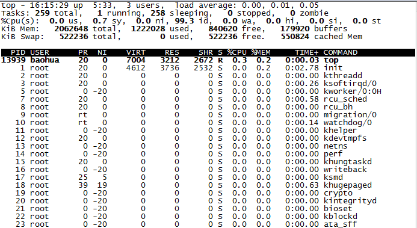

----------

#### Linux常用命令 ####

5/21/2019 3 :39 :35 PM 

----------

ls命令最基本的形式会显示当前目录下的文件和目录

- ls

|命令 | 作用 |
|--- | ---|
| ls -F |  显示文件夹后的/ |
|ls -a | 显示包括隐藏文件的所有文件列表 |
|ls -F -R | 它列出了当前目录下包含的子目录中的文件|
| ls -l fileName | 过滤要显示的文件信息 |

处理文件

- touch

|命令 | 作用 |
|--- | ---|
| touch fileName | 创建文件 |

- cp

|命令 | 作用 |
|--- | ---|
|cp source dest | 复制文件 |
|cp -i source dest | 带提示信息的复制 |
|cp -v source dest | 带日志提示的复制 |
|cp -r source dest | 遍历复制 |

- mv

|命令 | 作用 |
|--- | ---|
| mv file1 file2| 修改文件名 |
| cp source dest |移动文件 |

- rm

|命令 | 作用 |
| --- | --- |
| rm filenName | 删除文件 |
| rm -i fileName | 带提示的删除文件 |
| rm -f fileName | 强制删除文件 |
| rm -rf dirName | 删除文件夹，或遍历删除文件 |

- mkdir

|命令 | 作用 |
| --- | --- |
|mkdir dirName | 创建文件夹 |
|mkdir -p New_Dir/Sub_Dir/Under_Dir| 同时创建多个目录和子目录|

- rmdir

|命令 | 作用 |
| --- | --- |
| rmdir dirName | 删除空文件夹 |
| rm -ri dirName | 遍历提醒删除文件夹下的文件 |
| rm -rf dirName | 删除文件夹，或遍历删除文件 |

- tree

|命令 | 作用 |
| --- | --- |
|tree dirName | 树形打印目录|

#### 查看文件内容 ####

- file

|命令 | 作用 |
| --- | --- |
| file fileName | 查看文件类型 |

- cat

|命令 | 作用 |
| --- | --- |
| cat fileName | 查看文本文件内容 |
| cat -n fileName | 带行号的显示文本内容 |
| cat -b fileName | 只给有文本的行加上行号 |
| cat -T fileName | 不显示制表符 |

- more

|命令 | 作用 |
| --- | --- |
|more fileName | 按页显示文本内容 |

- less

|命令 | 作用 |
| --- | --- |
|less fileName | 和more命令基本一样，一次显示一屏的文件文本 |

查看部分文件

- tail

|命令 | 作用 |
| --- | --- |
| tail fileName | 显示文本文件的最后10行 |
| tail -n 2 fileName |显示文本文件的最后2行|
| tail -f fileName | 实时监测系统日志 |

- head

|命令 | 作用 |
| --- | --- |
|head fileName |  显示文件前10行的文本|
|head -5 fileName |  显示文件前10行的文本|

#### 探测进程 ####

- ps

|命令 | 作用 |
| --- | --- |
|-A |显示所有进程
|-N |显示与指定参数不符的所有进程
|-a |显示除控制进程（ session leader① ）和无终端进程外的所有进程
|-d |显示除控制进程外的所有进程
|-e |显示所有进程
|-C |cmdlist 显示包含在cmdlist列表中的进程
|-G |grplist 显示组ID在grplist列表中的进程
|-U |userlist 显示属主的用户ID在userlist列表中的进程
|-g |grplist 显示会话或组ID在grplist列表中的进程②
|-p |pidlist 显示PID在pidlist列表中的进程
|-s |sesslist 显示会话ID在sesslist列表中的进程
|-t |ttylist 显示终端ID在ttylist列表中的进程
|-u |userlist 显示有效用户ID在userlist列表中的进程
|-F |显示更多额外输出（相对-f参数而言）
|-O |format 显示默认的输出列以及format列表指定的特定列
|-M |显示进程的安全信息
|-c |显示进程的额外调度器信息
|-f |显示完整格式的输出
|-j |显示任务信息
|-l |显示长列表
|-o |format 仅显示由format指定的列
|-y |不要显示进程标记（ process flag，表明进程状态的标记）
|-Z |显示安全标签（ security context） ① 信息
|-H |用层级格式来显示进程（树状，用来显示父进程）
|-n |namelist 定义了WCHAN列显示的值
|-w |采用宽输出模式，不限宽度显示
|-L |显示进程中的线程
|-V| 显示ps命令的版本号

实时监测进程

- top

结束进程
- kill

|命令 | 作用 |
| --- | --- |
| kill pid | 结束pid进程 |
| kill -s HUP pid | 强制终止 |

- killall 

支持通过进程名而不是PID来结束进程

|命令 | 作用 |
| --- | --- |
| killall pidName | 结束pid进程 |

#### 挂载存储媒体 ####

- mount

|命令 | 作用 |
| --- | --- |
|mount -t type device directory| 手动挂载媒体设备的基本命令|

> mount -t vfat /dev/sdb1 /media/disk

|命令 | 作用 |
| --- | --- |
|-a |挂载/etc/fstab文件中指定的所有文件系统
|-f |使mount命令模拟挂载设备，但并不真的挂载
|-F |和-a参数一起使用时，会同时挂载所有文件系统
|-v |详细模式，将会说明挂载设备的每一步
|-I |不启用任何/sbin/mount.filesystem下的文件系统帮助文件
|-l |给ext2、 ext3或XFS文件系统自动添加文件系统标签
|-n |挂载设备，但不注册到/etc/mtab已挂载设备文件中
|-p |num 进行加密挂载时，从文件描述符num中获得密码短语
|-s |忽略该文件系统不支持的挂载选项
|-r |将设备挂载为只读的
|-w |将设备挂载为可读写的（默认参数）
|-L |label 将设备按指定的label挂载
|-U |uuid 将设备按指定的uuid挂载
|-O |和-a参数一起使用，限制命令只作用到特定的一组文件系统上
|-o |给文件系统添加特定的选项

- umount

|命令 | 作用 |
| --- | --- |
|umount [directory  device ]|基本命令的格式

- df

查看所有已挂载磁盘的使用情况

|命令 | 作用 |
| --- | --- |
|df -h | 用户易读的形式显示 |

- du

显示某个特定目录（默认情况下是当前目录）的磁盘使用情况

|命令 | 作用 |
| --- | --- |
| du -c | 显示所有已列出文件总的大小
| du -h | 按用户易读的格式输出大小
| du -s | 显示每个输出参数的总计

#### 处理数据文件 ####

排序数据

- sort

默认情况下， sort命令会把数字当做字符来执行标准的字符排序

|命令 | 作用 |
| --- | --- |
| sort fileName | 按字符顺序排序文件内容 |
| sort -n fileName | 按数字顺序排序文件内容 |
| sort -m fileName | 按月排序 |

|命令| 双破折线 | 作用 |
| --- | --- | --- |
|-b |--ignore-leading-blanks |排序时忽略起始的空白
|-C |--check=quiet |不排序，如果数据无序也不要报告
|-c |--check |不排序，但检查输入数据是不是已排序；未排序的话，报告
|-d |--dictionary-order |仅考虑空白和字母，不考虑特殊字符
|-f |--ignore-case |默认情况下，会将大写字母排在前面；这个参数会忽略大小写
|-g |--general-number-sort |按通用数值来排序（跟-n不同，把值当浮点数来排序，支持科学计数法表示的值）
|-i |--ignore-nonprinting |在排序时忽略不可打印字符
|-k |--key=POS1[,POS2] |排序从POS1位置开始；如果指定了POS2的话，到POS2位置结束
|-M |--month-sort |用三字符月份名按月份排序
|-m |--merge |将两个已排序数据文件合并
|-n |--numeric-sort |按字符串数值来排序（并不转换为浮点数）
|-o |--output=file |将排序结果写出到指定的文件中
|-R |--random-sort |按随机生成的散列表的键值排序
|-R |--random-source=FILE |指定-R参数用到的随机字节的源文件
|-r |--reverse |反序排序（升序变成降序）
|-S |--buffer-size=SIZE |指定使用的内存大小
|-s |--stable |禁用最后重排序比较
|-T |--temporary-directory=DIR |指定一个位置来存储临时工作文件
|-t |--field-separator=SEP |指定一个用来区分键位置的字符
|-u |--unique |和-c参数一起使用时，检查严格排序；不和-c参数一起用时，仅输出第一例相似的两行
|-z |--zero-terminated |用NULL字符作为行尾，而不是用换行符

#### 搜索数据 ####

- grep

命令会在输入或指定的文件中查找包含匹配指定模式的字符的行

grep [options] pattern [file]

|命令 | 作用 |
| --- | --- |
| grep fileName | 匹配指定模式的字符的行 |
| grep -v pattern fileName | 反向搜索 |
| grep -n pattern fileName | 显示匹配模式行所在的行号 |
| grep -c pattern fileName | 显示有多少行含有匹配的模式 |
| grep -e pattern -e pattern file | 指定多个匹配模式 |

#### 压缩数据 ####

- gzip 用来压缩文件
- gzcat 用来查看压缩过的文本文件的内容
- gunzip 用来解压文件

#### 归档数据 ####

- tar

tar function [options] object1 object2 ...

|命令 |长名称 | 作用 |
| --- | --- | --- |
|-A |--concatenate |将一个已有tar归档文件追加到另一个已有tar归档文件
|-c |--create |创建一个新的tar归档文件
|-d |--diff |检查归档文件和文件系统的不同之处
|-d |--delete |从已有tar归档文件中删除
|-r |--append |追加文件到已有tar归档文件末尾
|-t |--list |列出已有tar归档文件的内容
|-u |--update |将比tar归档文件中已有的同名文件新的文件追加到该tar归档文件中
|-x |--extract |从已有tar归档文件中提取文件

|选项 | 描述 |
| --- | --- |
|-C dir |切换到指定目录
|-f file |输出结果到文件或设备file
|-j |将输出重定向给bzip2命令来压缩内容
|-p |保留所有文件权限
|-v |在处理文件时显示文件
|-z |将输出重定向给gzip命令来压缩内容

> tar -cvf test.tar test/ test2/

上面的命令创建了名为test.tar的归档文件，含有test和test2目录内容。

> tar -tf test.tar

列出tar文件test.tar的内容（但并不提取文件）

> tar -xvf test.tar

通过这一命令从tar文件test.tar中提取内容。如果tar文件是从一个目录结构创建的，那整个目录结构都会在当前目录下重新创建

.tgz结尾文件可以使用命令tar -zxvf filename.tgz来解压