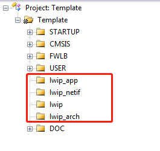
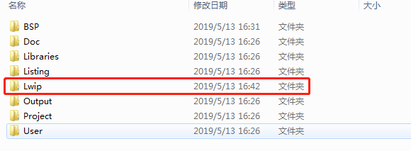
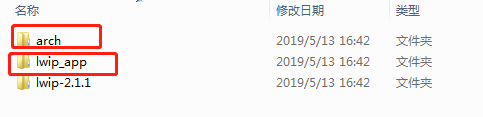
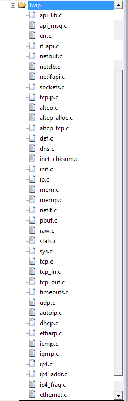
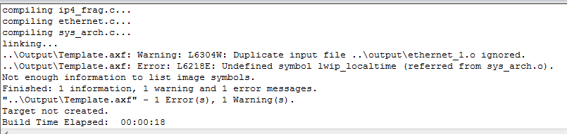

----------

5/13/2019 4 :10 :31 PM 

LWIP 裸机移植教程

----------

#### 硬件环境 ####

MCU：STM32F407，PHY芯片为：LAN8720A

#### 准备工作 ####

下载LWIP源码，下载地址为：[http://download.savannah.nongnu.org/releases/lwip/](http://download.savannah.nongnu.org/releases/lwip/)

下载最新源码包和示例压缩包：

这里需要一个标准的STM32工程模板：关于如何新建标准工程模板，[点击这里](https://github.com/peachzz/Blog/blob/master/%E5%B5%8C%E5%85%A5%E5%BC%8F/STM32%E5%BC%80%E5%8F%91/STM32%E6%A0%87%E5%87%86%E5%BA%93%E6%96%B0%E5%BB%BA%E5%B7%A5%E7%A8%8B%E6%95%99%E7%A8%8B/STM32%E6%96%B0%E5%BB%BA%E5%B7%A5%E7%A8%8B%E6%95%99%E7%A8%8B%20.md)

还需要一款开发板

准备工作到此完成

开始移植

打开模板工程，新建lwip\_app,lwip\_arch,lwip\_netif,lwip分组:

将lwip-2.1.1.zip源码包解压复制到工程模板\template\Lwip文件夹下，（Lwip为新创建的文件夹）

在\template\Lwip路径下新建两个文件夹arch、lwip\_app

向工程中添加源码文件

双击工程中lwip文件夹

分别添加如下路径的源码：

| 路径 | 文件名称 |
| :--- | :--- |
| \template\Lwip\lwip-2.1.1\src\api | 所有文件 |
| \template\Lwip\lwip-2.1.1\src\core | 除了ipv6文件夹外的所有文件 |
| \template\Lwip\lwip-2.1.1\src\netif | ethernet.c |

添加完成后的图片如下：

双击工程中lwip_netif文件夹，添加ethernet.c文件

在\template\Lwip\arch路径下新建cc.h、lwipopts.h、perf.h、sys_arch.c文件

其中cc.h内容为：

	#ifndef __CC_H__
	#define __CC_H__

	#if 0
	#include "cpu.h"
	
	typedef unsigned   char    u8_t;
	typedef signed     char    s8_t;
	typedef unsigned   short   u16_t;
	typedef signed     short   s16_t;
	typedef unsigned   long    u32_t;
	typedef signed     long    s32_t;
	typedef u32_t mem_ptr_t;
	typedef int sys_prot_t;
	
	#endif
	#define U16_F "hu"
	#define S16_F "d"
	#define X16_F "hx"
	#define U32_F "u"
	#define S32_F "d"
	#define X32_F "x"
	#define SZT_F "uz" 
	
	/* define compiler specific symbols */
	#if defined (__ICCARM__)
	
	#define PACK_STRUCT_BEGIN
	#define PACK_STRUCT_STRUCT 
	#define PACK_STRUCT_END
	#define PACK_STRUCT_FIELD(x) x
	#define PACK_STRUCT_USE_INCLUDES
	
	#elif defined (__CC_ARM)
	
	#define PACK_STRUCT_BEGIN __packed
	#define PACK_STRUCT_STRUCT 
	#define PACK_STRUCT_END
	#define PACK_STRUCT_FIELD(x) x
	
	#elif defined (__GNUC__)
	
	#define PACK_STRUCT_BEGIN
	#define PACK_STRUCT_STRUCT __attribute__ ((__packed__))
	#define PACK_STRUCT_END
	#define PACK_STRUCT_FIELD(x) x
	
	#elif defined (__TASKING__)
	
	#define PACK_STRUCT_BEGIN
	#define PACK_STRUCT_STRUCT
	#define PACK_STRUCT_END
	#define PACK_STRUCT_FIELD(x) x
	
	#endif
	
	#define LWIP_PLATFORM_ASSERT(x) //do { if(!(x)) while(1); } while(0)
	
	#endif /* __CC_H__ */

perf.h内容为：

    #ifndef __PERF_H__
	#define __PERF_H__
	
	#define PERF_START    /* null definition */
	#define PERF_STOP(x)  /* null definition */
	
	#endif /* __PERF_H__ */

lwipopts.h内容为：

	#ifndef __LWIPOPTS_H__
	#define __LWIPOPTS_H__
	
	/**
	 * SYS_LIGHTWEIGHT_PROT==1: if you want inter-task protection for certain
	 * critical regions during buffer allocation, deallocation and memory
	 * allocation and deallocation.
	 */
	#define SYS_LIGHTWEIGHT_PROT    0
	
	/**
	 * NO_SYS==1: Provides VERY minimal functionality. Otherwise,
	 * use lwIP facilities.
	 */
	#define NO_SYS                  1
	
	/**
	 * NO_SYS_NO_TIMERS==1: Drop support for sys_timeout when NO_SYS==1
	 * Mainly for compatibility to old versions.
	 */
	#define NO_SYS_NO_TIMERS        1
	
	/* ---------- Memory options ---------- */
	/* MEM_ALIGNMENT: should be set to the alignment of the CPU for which
	   lwIP is compiled. 4 byte alignment -> define MEM_ALIGNMENT to 4, 2
	   byte alignment -> define MEM_ALIGNMENT to 2. */
	#define MEM_ALIGNMENT           4
	
	/* MEM_SIZE: the size of the heap memory. If the application will send
	a lot of data that needs to be copied, this should be set high. */
	#define MEM_SIZE                (10*1024)
	
	/* MEMP_NUM_PBUF: the number of memp struct pbufs. If the application
	   sends a lot of data out of ROM (or other static memory), this
	   should be set high. */
	#define MEMP_NUM_PBUF           100
	/* MEMP_NUM_UDP_PCB: the number of UDP protocol control blocks. One
	   per active UDP "connection". */
	#define MEMP_NUM_UDP_PCB        6
	/* MEMP_NUM_TCP_PCB: the number of simulatenously active TCP
	   connections. */
	#define MEMP_NUM_TCP_PCB        10
	/* MEMP_NUM_TCP_PCB_LISTEN: the number of listening TCP
	   connections. */
	#define MEMP_NUM_TCP_PCB_LISTEN 6
	/* MEMP_NUM_TCP_SEG: the number of simultaneously queued TCP
	   segments. */
	#define MEMP_NUM_TCP_SEG        12
	/* MEMP_NUM_SYS_TIMEOUT: the number of simulateously active
	   timeouts. */
	#define MEMP_NUM_SYS_TIMEOUT    10
	
	
	/* ---------- Pbuf options ---------- */
	/* PBUF_POOL_SIZE: the number of buffers in the pbuf pool. */
	#define PBUF_POOL_SIZE          20
	
	/* PBUF_POOL_BUFSIZE: the size of each pbuf in the pbuf pool. */
	#define PBUF_POOL_BUFSIZE       500
	
	
	/* ---------- TCP options ---------- */
	#define LWIP_TCP                1
	#define TCP_TTL                 255
	
	/* Controls if TCP should queue segments that arrive out of
	   order. Define to 0 if your device is low on memory. */
	#define TCP_QUEUE_OOSEQ         0
	
	/* TCP Maximum segment size. */
	#define TCP_MSS                 (1500 - 40)/* TCP_MSS = (Ethernet MTU - IP header size - TCP header size) */
	
	/* TCP sender buffer space (bytes). */
	#define TCP_SND_BUF             (4*TCP_MSS)
	
	/*  TCP_SND_QUEUELEN: TCP sender buffer space (pbufs). This must be at least
	  as much as (2 * TCP_SND_BUF/TCP_MSS) for things to work. */
	
	#define TCP_SND_QUEUELEN        (2* TCP_SND_BUF/TCP_MSS)
	
	/* TCP receive window. */
	#define TCP_WND                 (2*TCP_MSS)
	
	
	/* ---------- ICMP options ---------- */
	#define LWIP_ICMP                       1
	
	
	/* ---------- DHCP options ---------- */
	/* Define LWIP_DHCP to 1 if you want DHCP configuration of
	   interfaces. DHCP is not implemented in lwIP 0.5.1, however, so
	   turning this on does currently not work. */
	#define LWIP_DHCP               1
	
	
	/* ---------- UDP options ---------- */
	#define LWIP_UDP                1
	#define UDP_TTL                 255
	
	
	/* ---------- Statistics options ---------- */
	#define LWIP_STATS 0
	#define LWIP_PROVIDE_ERRNO 1
	
	/* ---------- link callback options ---------- */
	/* LWIP_NETIF_LINK_CALLBACK==1: Support a callback function from an interface
	 * whenever the link changes (i.e., link down)
	 */
	#define LWIP_NETIF_LINK_CALLBACK        1
	
	/*
	   --------------------------------------
	   ---------- Checksum options ----------
	   --------------------------------------
	*/
	
	/* 
	The STM32F4x7 allows computing and verifying the IP, UDP, TCP and ICMP checksums by hardware:
	 - To use this feature let the following define uncommented.
	 - To disable it and process by CPU comment the  the checksum.
	*/
	#define CHECKSUM_BY_HARDWARE 
	
	
	#ifdef CHECKSUM_BY_HARDWARE
	  /* CHECKSUM_GEN_IP==0: Generate checksums by hardware for outgoing IP packets.*/
	  #define CHECKSUM_GEN_IP                 0
	  /* CHECKSUM_GEN_UDP==0: Generate checksums by hardware for outgoing UDP packets.*/
	  #define CHECKSUM_GEN_UDP                0
	  /* CHECKSUM_GEN_TCP==0: Generate checksums by hardware for outgoing TCP packets.*/
	  #define CHECKSUM_GEN_TCP                0 
	  /* CHECKSUM_CHECK_IP==0: Check checksums by hardware for incoming IP packets.*/
	  #define CHECKSUM_CHECK_IP               0
	  /* CHECKSUM_CHECK_UDP==0: Check checksums by hardware for incoming UDP packets.*/
	  #define CHECKSUM_CHECK_UDP              0
	  /* CHECKSUM_CHECK_TCP==0: Check checksums by hardware for incoming TCP packets.*/
	  #define CHECKSUM_CHECK_TCP              0
	  /* CHECKSUM_CHECK_ICMP==0: Check checksums by hardware for incoming ICMP packets.*/
	  #define CHECKSUM_GEN_ICMP               0
	#else
	  /* CHECKSUM_GEN_IP==1: Generate checksums in software for outgoing IP packets.*/
	  #define CHECKSUM_GEN_IP                 1
	  /* CHECKSUM_GEN_UDP==1: Generate checksums in software for outgoing UDP packets.*/
	  #define CHECKSUM_GEN_UDP                1
	  /* CHECKSUM_GEN_TCP==1: Generate checksums in software for outgoing TCP packets.*/
	  #define CHECKSUM_GEN_TCP                1
	  /* CHECKSUM_CHECK_IP==1: Check checksums in software for incoming IP packets.*/
	  #define CHECKSUM_CHECK_IP               1
	  /* CHECKSUM_CHECK_UDP==1: Check checksums in software for incoming UDP packets.*/
	  #define CHECKSUM_CHECK_UDP              1
	  /* CHECKSUM_CHECK_TCP==1: Check checksums in software for incoming TCP packets.*/
	  #define CHECKSUM_CHECK_TCP              1
	  /* CHECKSUM_CHECK_ICMP==1: Check checksums by hardware for incoming ICMP packets.*/
	  #define CHECKSUM_GEN_ICMP               1
	#endif
	
	
	/*
	   ----------------------------------------------
	   ---------- Sequential layer options ----------
	   ----------------------------------------------
	*/
	/**
	 * LWIP_NETCONN==1: Enable Netconn API (require to use api_lib.c)
	 */
	#define LWIP_NETCONN                    0
	
	/*
	   ------------------------------------
	   ---------- Socket options ----------
	   ------------------------------------
	*/
	/**
	 * LWIP_SOCKET==1: Enable Socket API (require to use sockets.c)
	 */
	#define LWIP_SOCKET                     0
	
	
	/*
	   ----------------------------------------
	   ---------- Lwip Debug options ----------
	   ----------------------------------------
	*/
	//#define LWIP_DEBUG                      1
	#define LWIP_TIMERS	 											1
	#endif /* __LWIPOPTS_H__ */

sys_arch.c内容为：

	/* lwIP includes. */
	#include "lwip/debug.h"
	#include "lwip/def.h"
	#include "lwip/sys.h"
	#include "lwip/mem.h"
	#include "timeouts.h"

	//为LWIP提供计时
	extern uint32_t lwip_localtime;//lwip本地时间计数器,单位:ms
	u32_t sys_now(void)
	{
		return lwip_localtime;
	}

双击lwip_arch文件夹添加sys_arch.c文件

导入文件lwip头文件

| 添加头文件路径 |
| :--- | 
| ..\Lwip |
|..\Lwip\arch |
|..\Lwip\lwip_app |
|..\Lwip\lwip-2.1.1\src\include |
|..\Lwip\lwip-2.1.1\src\include\lwip |
|..\Lwip\lwip-2.1.1\src\include\lwip\priv |
|..\Lwip\lwip-2.1.1\src\include\lwip\apps |
|..\Lwip\lwip-2.1.1\src\include\lwip\prot |
|..\Lwip\lwip-2.1.1\src\include\netif |

添加完以后编译工程，提示如下错误：

先忽略报出的错误

