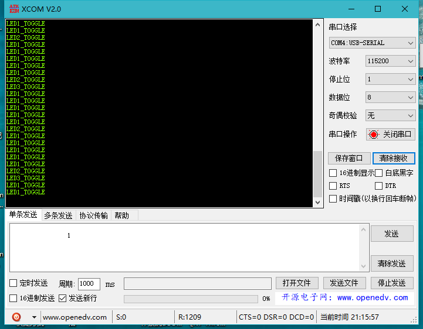

----------

#### uCosIII移植STM32F103教程 ####

8/17/2020 3 : 42 :28 PM 

Author :terrycoder 

----------

#### 移植环境 ####

1. **本文所使用的移植环境如下：**

	- 硬件环境为：STM32F103ZET6
	- 软件环境为： MDK5.23

准备工作

开始移植前需要准备一个空的工程模板和uCosIII官方示例包，这里使用的是Micrium_uC-Eval-STM32F107_uCOS-III.zip版本，解压示例包[ 下载地址](https://www.micrium.com/download/micrium_uc-eval-stm32f107_ucos-iii/),解压后的文件如下：

**向工程添加所需要的文件**

然后在空的工程文件夹User下创建App和Bsp文件夹，接着进入EvalBoards文件夹下的\Micrium\uC-Eval-STM32F107\uCOS-III路径，拷贝如下九个文件到App文件夹中。

然后进入\EvalBoards\Micrium\uC-Eval-STM32F107\BSP路径下拷贝bsp.c和bsp.h文件到Bsp文件夹中

接着返回\Micrium\Software路径下，拷贝uC-CPU、uC-LIB、uCOS-III到工程User路径下

**在工程中添加文件分组**

完成上述步骤后在工程中创建如下组：APP、BSP、uCos-III_CPU、uCos-III_LIB、uCos-III_Port、uCos-III_Source，

**添加文件到对应分组**

向APP分组添加“\User\APP”文件夹下的所有文件，

向BSP分组添加“\User\BSP”文件夹下的所有文件

向“ uC/CPU” 分组添加“\User\uC-CPU”文件夹下的所有文件和“ \User\uCCPU\ARM-Cortex-M3\RealView”文件夹下的所有文件

向 “uC/LIB ” 分 组 添 加 “\User\uC-LIB ” 文 件 夹 下 的 所 有 文 件 和 “\User\uCLIB\Ports\ARM-Cortex-M3\RealView”文件夹下的所有文件

向“uC/OS-III Source” 分组添加“\User\uCOS-III\Source”文件夹下的所有文件

向 “ uC/OS-III Port ” 分 组 添 加 “ \User\uCOS-III\Ports\ARM-CortexM3\Generic\RealView”文件夹下的所有文件

至此，我们的源码文件就添加到工程中了，当然此时仅仅是添加而已，并不是移植成功了，如果你编译一下工程就会发现一大堆错误，所以还需努力移植工程才行。

**添加头文件路径到工程中**

uCos-III 的源码已经添加到开发环境的组文件夹下面，编译的时候需要为这些源文件指定头文件的路径，不然编译会报错，此时我们先将头文件添加到我们的工程中，具体见图

至此， uCos-III 的整体工程基本移植完毕，我们需要修改 uCos-III 配置文件，按照我们的需求来进行修改

**具体的工程文件修改**

首先修改工程的启动文件“ startup_stm32f10x_hd.s”。其中将 PendSV_Handler 和 SysTick_Handler 分 别 改 为OS_CPU_PendSVHandler 和 OS_CPU_SysTickHandler，共两处，因为 uCOS 官方已经给我们处理好对应的中断函数，就无需我们自己处理与系统相关的中断了，同时我们还需要将
stm32f10x_it.c 文件中的 PendSV_Handler 和 SysTick_Handler 函数注释掉（当然不注释掉也没问题的） 

修改 startup_stm32f10x_hd.s 文件（第 76、 77 行）

修改 startup_stm32f10x_hd.s 文件（第 192、 196 行）

注释掉 PendSV_Handler 和 SysTick_Handler 函数(在stm32f10x_it.c文件第126和135行)

**修改源码中的 bsp.c 与 bsp.h 文件**

因为bsp 就是板级相关的文件，也就是对应开发板的文件，而 uCOS III 源码的bsp 肯定是与我们的板子不一样，所以就需要进行修改，而且以后我们的板级文件都在bsp.c 文件进行初始化，所以按照我们修改好的源码进行修改即可，

	#define  BSP_MODULE
	#include <bsp.h>
	
	CPU_INT32U  BSP_CPU_ClkFreq_MHz;
	
	#define  DWT_CR      *(CPU_REG32 *)0xE0001000
	#define  DWT_CYCCNT  *(CPU_REG32 *)0xE0001004
	#define  DEM_CR      *(CPU_REG32 *)0xE000EDFC
	#define  DBGMCU_CR   *(CPU_REG32 *)0xE0042004
	
	#define  DBGMCU_CR_TRACE_IOEN_MASK       0x10
	#define  DBGMCU_CR_TRACE_MODE_ASYNC      0x00
	#define  DBGMCU_CR_TRACE_MODE_SYNC_01    0x40
	#define  DBGMCU_CR_TRACE_MODE_SYNC_02    0x80
	#define  DBGMCU_CR_TRACE_MODE_SYNC_04    0xC0
	#define  DBGMCU_CR_TRACE_MODE_MASK       0xC0
	
	#define  DEM_CR_TRCENA                   (1 << 24)
	
	#define  DWT_CR_CYCCNTENA                (1 <<  0)
	
	
	void  BSP_Init (void)
	{
	   
	}
	
	
	CPU_INT32U  BSP_CPU_ClkFreq (void)
	{
	    RCC_ClocksTypeDef  rcc_clocks;
	
	
	    RCC_GetClocksFreq(&rcc_clocks);
	
	    return ((CPU_INT32U)rcc_clocks.HCLK_Frequency);
	}
	
	#if ((APP_CFG_PROBE_OS_PLUGIN_EN == DEF_ENABLED) && \
	     (OS_PROBE_HOOKS_EN          == 1))
	void  OSProbe_TmrInit (void)
	{
	}
	#endif
	
	#if ((APP_CFG_PROBE_OS_PLUGIN_EN == DEF_ENABLED) && \
	     (OS_PROBE_HOOKS_EN          == 1))
	CPU_INT32U  OSProbe_TmrRd (void)
	{
	    return ((CPU_INT32U)DWT_CYCCNT);
	}
	#endif
	
	
	#if (CPU_CFG_TS_TMR_EN == DEF_ENABLED)
	void  CPU_TS_TmrInit (void)
	{
	    CPU_INT32U  cpu_clk_freq_hz;
	
	
	    DEM_CR         |= (CPU_INT32U)DEM_CR_TRCENA;                /* Enable Cortex-M3's DWT CYCCNT reg.                   */
	    DWT_CYCCNT      = (CPU_INT32U)0u;
	    DWT_CR         |= (CPU_INT32U)DWT_CR_CYCCNTENA;
	
	    cpu_clk_freq_hz = BSP_CPU_ClkFreq();
	    CPU_TS_TmrFreqSet(cpu_clk_freq_hz);
	}
	#endif
	
	#if (CPU_CFG_TS_TMR_EN == DEF_ENABLED)
	CPU_TS_TMR  CPU_TS_TmrRd (void)
	{
	    return ((CPU_TS_TMR)DWT_CYCCNT);
	}
	#endif

bsp.h内容如下：

	#ifndef  BSP_PRESENT
	#define  BSP_PRESENT
	
	#ifdef   BSP_MODULE
	#define  BSP_EXT
	#else
	#define  BSP_EXT  extern
	#endif
	
	*/
	#include  <stdarg.h>
	#include  <stdio.h>
	
	#include  <cpu.h>
	#include  <cpu_core.h>
	
	#include  <lib_ascii.h>
	#include  <lib_def.h>
	#include  <lib_mem.h>
	#include  <lib_str.h>
	
	#include  "stm32f10x.h"
	#include  <app_cfg.h>
	
	//#include  <bsp_led.h>
	
	
	void BSP_Init(void);
	CPU_INT32U  BSP_CPU_ClkFreq (void);
	/*
	*********************************************************************************************************
	*                                             MODULE END
	*********************************************************************************************************
	*/
	
	
	#endif                       /* End of module include.     

删除工程里面的main.c文件，因为app.c中也有main函数，修改app.c文件如下：

	#include <includes.h>
	
	int  main (void)
	{
		OS_ERR  err;
	
	    OSInit(&err);                                               /* Init uC/OS-III.                                      */
	
	    OSTaskCreate((OS_TCB     *)&AppTaskStartTCB,                /* Create the start task                                */
	                 (CPU_CHAR   *)"App Task Start",
	                 (OS_TASK_PTR ) AppTaskStart,
	                 (void       *) 0,
	                 (OS_PRIO     ) APP_TASK_START_PRIO,
	                 (CPU_STK    *)&AppTaskStartStk[0],
	                 (CPU_STK_SIZE) APP_TASK_START_STK_SIZE / 10,
	                 (CPU_STK_SIZE) APP_TASK_START_STK_SIZE,
	                 (OS_MSG_QTY  ) 5u,
	                 (OS_TICK     ) 0u,
	                 (void       *) 0,
	                 (OS_OPT      )(OS_OPT_TASK_STK_CHK | OS_OPT_TASK_STK_CLR),
	                 (OS_ERR     *)&err);
	
	    OSStart(&err);                                              /* Start multitasking (i.e. give control to uC/OS-III). */
	}
	
	static  void  AppTaskStart (void *p_arg)
	{
	    CPU_INT32U  cpu_clk_freq;
	    CPU_INT32U  cnts;
	    OS_ERR      err;
	
	
	   (void)p_arg;
	
	    BSP_Init();                                                 /* Initialize BSP functions                             */
	    CPU_Init();
	
	    cpu_clk_freq = BSP_CPU_ClkFreq();                           /* Determine SysTick reference freq.                    */
	    cnts = cpu_clk_freq / (CPU_INT32U)OSCfg_TickRate_Hz;        /* Determine nbr SysTick increments                     */
	    OS_CPU_SysTickInit(cnts);                                   /* Init uC/OS periodic time src (SysTick).              */
	
	    Mem_Init();                                                 /* Initialize Memory Management Module                  */
	
	#if OS_CFG_STAT_TASK_EN > 0u
	    OSStatTaskCPUUsageInit(&err);                               /* Compute CPU capacity with no task running            */
	#endif
	
	    CPU_IntDisMeasMaxCurReset();
	
	//#if (APP_CFG_SERIAL_EN == DEF_ENABLED)
	//    BSP_Ser_Init(115200);                                       /* Enable Serial Interface                              */
	//#endif
	    
	//    APP_TRACE_INFO(("Creating Application Tasks...\n\r"));
	    AppTaskCreate();                                            /* Create Application Tasks                             */
	    
	//    APP_TRACE_INFO(("Creating Application Events...\n\r"));
	    AppObjCreate();                                             /* Create Application Objects                           */
	    
		OSTaskDel ( & AppTaskStartTCB, & err );
	//    while (DEF_TRUE) {                                          /* Task body, always written as an infinite loop.       */
	//        BSP_LED_Toggle(0);
	//        OSTimeDlyHMSM(0, 0, 0, 100,
	//                      OS_OPT_TIME_HMSM_STRICT,
	//                      &err);
	//    }
	}
	
	static  void  AppTaskCreate (void)
	{
	}
	
	static  void  AppObjCreate (void)
	{
	}

编译工程通过，此时系统移植以完毕。

**添加测试程序**

在App.c中添加如下内容：

	static  OS_TCB   AppLed1TCB;
	static  OS_TCB   AppLed2TCB;
	static  OS_TCB   AppLed3TCB;
	
	static  CPU_STK  AppLed1Stk[APP_TASK_START_STK_SIZE];
	static  CPU_STK  AppLed2Stk[APP_TASK_START_STK_SIZE];
	static  CPU_STK  AppLed3Stk[APP_TASK_START_STK_SIZE];
	
	static  void  AppLed1 (void *p_arg);
	static  void  AppLed2 (void *p_arg);
	static  void  AppLed3 (void *p_arg);
	
	
	static  void  AppTaskCreate (void)
	{
	    OS_ERR  err;
	
	    OSTaskCreate((OS_TCB *)&AppLed1TCB,                    /* Create the start task                                */
	                 (CPU_CHAR *)"App Task Led1",
	                 (OS_TASK_PTR ) AppLed1,
	                 (void *) 0,
	                 (OS_PRIO     ) APP_TASK_LED1_PRIO,
	                 (CPU_STK *)&AppLed1Stk[0],
	                 (CPU_STK_SIZE) APP_LED1_STK_SIZE / 10,
	                 (CPU_STK_SIZE) APP_LED1_STK_SIZE,
	                 (OS_MSG_QTY  ) 5u,
	                 (OS_TICK     ) 0u,
	                 (void *) 0,
	                 (OS_OPT      )(OS_OPT_TASK_STK_CHK | OS_OPT_TASK_STK_CLR),
	                 (OS_ERR *)&err);
	
	    OSTaskCreate((OS_TCB *)&AppLed2TCB,                    /* Create the start task                                */
	                 (CPU_CHAR *)"App Task Led2",
	                 (OS_TASK_PTR ) AppLed2,
	                 (void *) 0,
	                 (OS_PRIO     ) APP_TASK_LED2_PRIO,
	                 (CPU_STK *)&AppLed2Stk[0],
	                 (CPU_STK_SIZE) APP_LED2_STK_SIZE / 10,
	                 (CPU_STK_SIZE) APP_LED2_STK_SIZE,
	                 (OS_MSG_QTY  ) 5u,
	                 (OS_TICK     ) 0u,
	                 (void *) 0,
	                 (OS_OPT      )(OS_OPT_TASK_STK_CHK | OS_OPT_TASK_STK_CLR),
	                 (OS_ERR *)&err);
	
	    OSTaskCreate((OS_TCB *)&AppLed3TCB,                    /* Create the start task                                */
	                 (CPU_CHAR *)"App Task Led3",
	                 (OS_TASK_PTR ) AppLed3,
	                 (void *) 0,
	                 (OS_PRIO     ) APP_TASK_LED3_PRIO,
	                 (CPU_STK *)&AppLed3Stk[0],
	                 (CPU_STK_SIZE) APP_LED3_STK_SIZE / 10,
	                 (CPU_STK_SIZE) APP_LED3_STK_SIZE,
	                 (OS_MSG_QTY  ) 5u,
	                 (OS_TICK     ) 0u,
	                 (void *) 0,
	                 (OS_OPT      )(OS_OPT_TASK_STK_CHK | OS_OPT_TASK_STK_CLR),
	                 (OS_ERR *)&err);
	}
	
	static  void  AppLed1 (void *p_arg)
	{
	    OS_ERR  err;
	
	    while(DEF_TRUE)
	    {
	        printf("LED1_TOGGLE\r\n");
	        OSTimeDlyHMSM(0, 0, 1, 0,
	                      OS_OPT_TIME_HMSM_STRICT,
	                      &err);
	    }
	}
	
	static  void  AppLed2 (void *p_arg)
	{
	    OS_ERR  err;
	
	    while(DEF_TRUE)
	    {
	        printf("LED2_TOGGLE\r\n");
	        OSTimeDlyHMSM(0, 0, 5, 0,
	                      OS_OPT_TIME_HMSM_STRICT,
	                      &err);
	    }
	}
	
	static  void  AppLed3 (void *p_arg)
	{
	    OS_ERR  err;
	
	    while(DEF_TRUE)
	    {
	        printf("LED3_TOGGLE\r\n");
	        OSTimeDlyHMSM(0, 0, 10, 0,
	                      OS_OPT_TIME_HMSM_STRICT,
	                      &err);
	    }
	}

在app_cfg.h中添加任务栈大小定义和任务优先级大小定义：

	#define  APP_TASK_LED1_PRIO                         3
	#define  APP_TASK_LED2_PRIO                         4
	#define  APP_TASK_LED3_PRIO                         5
	
	#define  APP_LED1_STK_SIZE                    			128
	#define  APP_LED2_STK_SIZE                    			128
	#define  APP_LED3_STK_SIZE                    			128

在工程BSP分组添加串口驱动文件，在bsp.h中添加头文件：

	#include "bsp_debug_usart.h"

在bsp.c的BSP_Init()函数中初始化串口，编译运行烧录开发板

可以看到三个任务按指定延时时间执行。