----------

#### uCosII移植STM32F103教程 ####

2019/5/14 21 :40 :46 

Author :terrycoder 

----------

#### 移植环境 ####

1. **本文所使用的移植环境如下：**

	- 硬件环境为：STM32F103ZET6
	- 软件环境为： MDK5.23

准备工作

开始移植前需要准备一个空的工程模板和uCosII官方示例包，这里使用的是Micrium_uC-Eval-STM32F107_uCOS-II.zip版本，解压示例包移动源码[ 下载地址](https://www.micrium.com/download/micrium_stm32f107_ucos-ii/)：

| 文件名 | 源文件路径 | 移动路径 |
| :--- | :--- |:--- |
| cpu.h、cpu_a.asm、cpu_c.c| \Micrium\Software\uC-CPU\ARM-Cortex-M3\RealView | \Micrium\Software\uC-CPU |
|lib_mem_a.asm |\Micrium\Software\uC-LIB\Ports\ARM-Cortex-M3\RealView|\Micrium\Software\uC-LIB |
|os_cpu.h、os_cpu_a.asm、os_cpu_c.c、os_dbg.c|\Micrium\Software\uCOS-II\Ports\ARM-Cortex-M3\Generic\RealView|\Micrium\Software\uCOS-II\Ports|

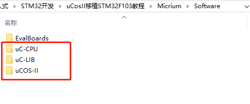

在工程模板下创建uCosII文件夹，将上图三个文件夹复制到uCosII文件夹路径下

打开工程模板，创建如下四个分组uCOS-II_CPU、uCOS-II_LIB、uCOS-II_Ports、uCOS-II_Source：

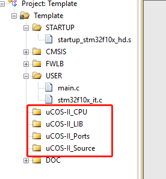

分别导入如下路径下的.C和.asm文件（和导入头文件路径也一致）：

|文件路径|
| :--- | 
|\template\uCOS-II\uC-CPU |
|\template\uCOS-II\uC-LIB|
|\template\uCOS-II\uCOS-II\Ports|
|\template\uCOS-II\uCOS-II\Source|

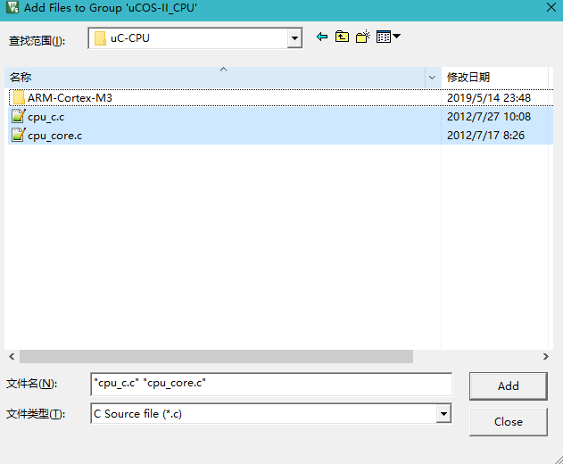

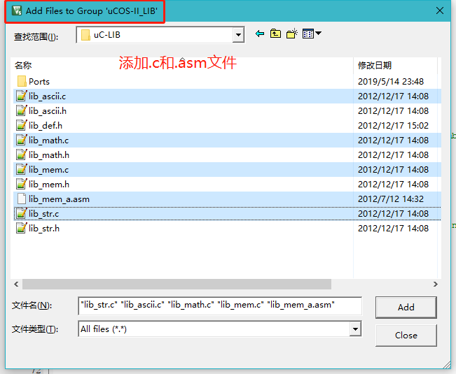

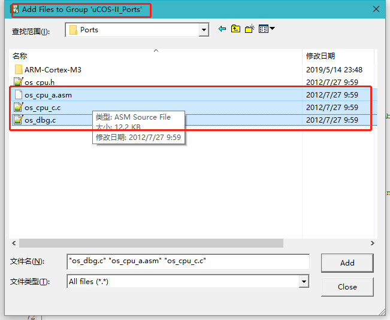

添加完源码工程的所有文件

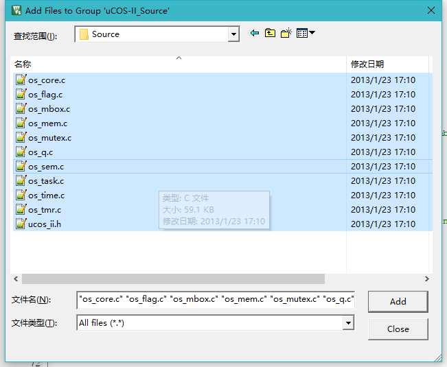

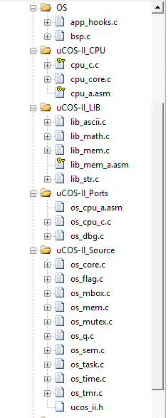

添加头文件路径

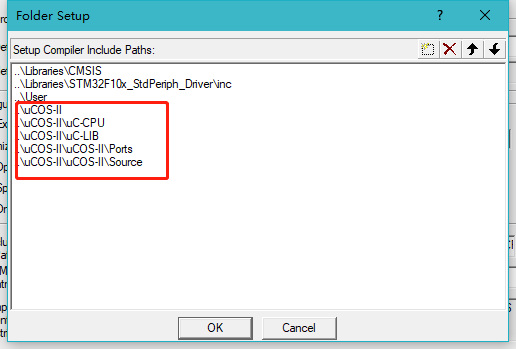

编译工程，提示缺少app_cfg.h文件，该文件在示例包\Micrium\Software\EvalBoards\Micrium\uC-Eval-STM32F107\uCOS-II路径下

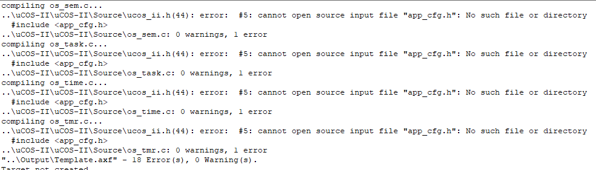

将该路径下的app_cfg.h、app_hooks.c、cpu_cfg.h、includes.h、lib_cfg.h、os_cfg.h文件复制到\template\uCOS-II\OS文件夹下，OS为新建文件夹

将\Micrium\Software\EvalBoards\Micrium\uC-Eval-STM32F107\BSP路径下bsp.c、bsp.h文件复制到\template\uCOS-II\OS文件夹下

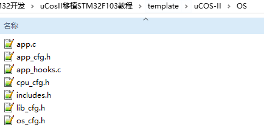

在工程中添加OS分组导入\template\uCOS-II\OS下.c文件，并导入头文件到工程后编译，提示没有stm32f10x_lib.h文件

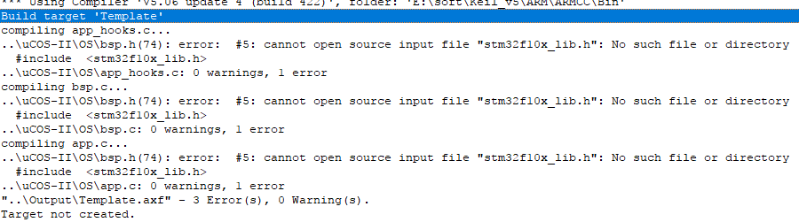

将stm32f10x_lib.h替换为stm32f10x.h，后再编译工程

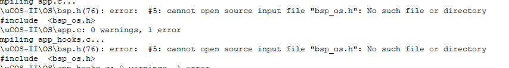

提示没有bsp_os.h文件,删除除如下代码外的其他所有代码

	void         BSP_Init                    (void);
	CPU_INT32U   BSP_CPU_ClkFreq             (void);

将bsp.c文件中

	static  void  BSP_LED_Init   (void);
	static  void  BSP_StatusInit (void);

	void  BSP_Init (void)函数中代码全部删除
	
	void  BSP_LED_Init (void)
	void  BSP_LED_On (CPU_INT08U led)

	void  BSP_LED_Off (CPU_INT08U led)
	void  BSP_LED_Toggle (CPU_INT08U led)
	static  void  BSP_StatusInit (void)
	CPU_BOOLEAN  BSP_StatusRd (CPU_INT08U  id)代码全部删除

将工程中main.c文件修改为：

	/* Includes ------------------------------------------------------------------*/
	#include <includes.h>
	
	static   OS_STK      AppTaskStartStk[APP_TASK_START_STK_SIZE];
	
	
	static  void    AppTaskCreate  (void);
	static	void	AppEventCreate (void);
	
	static  void    AppTaskStart   (void *p_arg);
	
	int main(void)
	{
	  /* Add your application code here*/
	  CPU_INT08U  err;
	
	
	    OSInit();                                                   /* Initialize "uC/OS-II, The Real-Time Kernel"              */
	
	    OSTaskCreateExt(AppTaskStart,                               /* Create the start task                                    */
	                    (void *)0,
	                    (OS_STK *)&AppTaskStartStk[APP_TASK_START_STK_SIZE - 1],
	                    APP_TASK_START_PRIO,
	                    APP_TASK_START_PRIO,
	                    (OS_STK *)&AppTaskStartStk[0],
	                    APP_TASK_START_STK_SIZE,
	                    (void *)0,
	                    OS_TASK_OPT_STK_CHK | OS_TASK_OPT_STK_CLR);
	
	#if (OS_TASK_NAME_EN > 0)
	    OSTaskNameSet(APP_TASK_START_PRIO, "Start Task", &err);
	#endif
	
	    OSStart();                          
	  /* Infinite loop */
	  while (1)
	  {
	  }
	}
	
	static  void  AppTaskStart (void *p_arg)
	{
	    CPU_INT32U  hclk_freq;
	    CPU_INT32U  cnts;
	
	
	   (void)p_arg;
	
	    BSP_Init();                                                 /* Init BSP fncts.                                          */
	
	    CPU_Init();                                                 /* Init CPU name & int. dis. time measuring fncts.          */
	
	    hclk_freq = BSP_CPU_ClkFreq();                              /* Determine SysTick reference freq.                        */
	    cnts  = hclk_freq / (CPU_INT32U)OS_TICKS_PER_SEC;           /* Determine nbr SysTick increments in OS_TICKS_PER_SEC.    */
	    OS_CPU_SysTickInit(cnts);                                   /* Init uC/OS periodic time src (SysTick).                  */
	
	    Mem_Init();                                                 /* Init Memory Management Module.                           */
	
	#if (OS_TASK_STAT_EN > 0)
	    OSStatInit();                                               /* Determine CPU capacity                                   */
	#endif
	
	#if (APP_CFG_SERIAL_EN == DEF_ENABLED)                          /* Init serial port 0 to 115,2000 baud for use  with  ...   */
	//    BSP_Ser_Init(115200);                                       /* ... tracing. See app_cfg.h.                              */
	#endif
	
	    printf(("Creating Application Events...\n\r"));
	    AppEventCreate();                                           /* Create Application Kernel objects                        */
	
	    printf(("Creating Application Tasks...\n\r"));
	    AppTaskCreate();                                            /* Create application tasks                                 */
	

	    while (DEF_TRUE) {                                          /* Task body, always written as an infinite loop.           */   
	        OSTimeDlyHMSM(0, 0, 0, 100);
	    }
	}
	

	static  void  AppTaskCreate (void)
	{

	}
	
	static void AppEventCreate(void)
	{

	}

#### 重新编译 ####

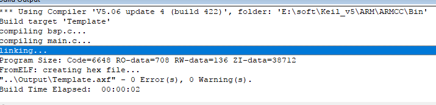

#### 注意 ####

移植完以后需要将startup_stm32f10x_hd.s文件中以下函数进行修改

|函数名 |修改为 |
|:---| :---|
|PendSV_Handler| OS_CPU_PendSVHandler |
|SysTick_Handler| OS_CPU_SysTickHandler |

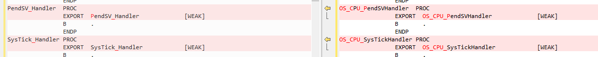

到此uCosII工程移植完毕

创建任务栈

	static   OS_STK      AppTaskStartStk[APP_TASK_START_STK_SIZE];
	
	static   OS_STK      AppTaskLed1Stk[APP_TASK_LED1_STK_SIZE];
	static   OS_STK      AppTaskLed2Stk[APP_TASK_LED2_STK_SIZE];
	static   OS_STK      AppTaskLed3Stk[APP_TASK_LED3_STK_SIZE];

创建任务和时间生成函数声明

	static  void    AppTaskCreate  (void);	
	static	void	AppEventCreate (void);
	
	static  void    AppTaskStart   (void *p_arg);
	
	static  void    AppTaskLed1   (void *p_arg);
	static  void    AppTaskLed2   (void *p_arg);
	static  void    AppTaskLed3   (void *p_arg);

任务栈大小定义

	#define  APP_TASK_START_STK_SIZE                    128

	#define  APP_TASK_LED1_STK_SIZE                     128
	
	#define  APP_TASK_LED2_STK_SIZE                     128
	
	#define  APP_TASK_LED3_STK_SIZE                     128
	
	#define  APP_CFG_TASK_LED_STK_SIZE                  128

任务优先级定义

	#define  APP_TASK_START_PRIO                        4

	#define  APP_TASK_LED1_PRIO                         5
	
	#define  APP_TASK_LED2_PRIO                         6
	
	#define  APP_TASK_LED3_PRIO                         7

main函数

	int main(void)
	{
	    /* Add your application code here*/
	    CPU_INT08U  err;
	    OSInit();
	
	    OSTaskCreateExt(AppTaskStart,                               /* Create the start task                                    */
	                    (void *)0,
	                    (OS_STK *)&AppTaskStartStk[APP_TASK_START_STK_SIZE - 1],
	                    APP_TASK_START_PRIO,
	                    APP_TASK_START_PRIO,
	                    (OS_STK *)&AppTaskStartStk[0],
	                    APP_TASK_START_STK_SIZE,
	                    (void *)0,
	                    OS_TASK_OPT_STK_CHK | OS_TASK_OPT_STK_CLR);
	
	#if (OS_TASK_NAME_EN > 0)
	    OSTaskNameSet(APP_TASK_START_PRIO, "Start Task", &err);
	#endif
	
	    OSStart();
	}

启动函数创建

	static  void  AppTaskStart (void *p_arg)
	{
	    CPU_INT32U  hclk_freq;
	    CPU_INT32U  cnts;
	
	
	    (void)p_arg;
	
	    BSP_Init();                                                 /* Init BSP fncts.                                          */
	
	    CPU_Init();                                                 /* Init CPU name & int. dis. time measuring fncts.          */
	
	    hclk_freq = BSP_CPU_ClkFreq();                              /* Determine SysTick reference freq.                        */
	    cnts  = hclk_freq / (CPU_INT32U)OS_TICKS_PER_SEC;           /* Determine nbr SysTick increments in OS_TICKS_PER_SEC.    */
	    OS_CPU_SysTickInit(cnts);                                   /* Init uC/OS periodic time src (SysTick).                  */
	
	    Mem_Init();                                                 /* Init Memory Management Module.                           */
	
	#if (OS_TASK_STAT_EN > 0)
	    OSStatInit();                                               /* Determine CPU capacity                                   */
	#endif
	
	    printf(("Creating Application Events...\n\r"));
	    AppEventCreate();                                           /* Create Application Kernel objects                        */
	
	    printf(("Creating Application Tasks...\n\r"));
	    AppTaskCreate();                                            /* Create application tasks                                 */
	
	}

任务内容创建

	static  void    AppTaskLed1(void *p_arg)
	{
	
	    p_arg = p_arg;
	
	    while(DEF_TRUE)
	    {
	        printf("LED1_TOGGLE\r\n");
	        OSTimeDlyHMSM(0, 0, 1, 0);
	    }
	}
	
	static  void AppTaskLed2(void *p_arg)
	{
	
	    p_arg = p_arg;
	
	    while(DEF_TRUE)
	    {
	        printf("LED2_TOGGLE\r\n");
	        OSTimeDlyHMSM(0, 0, 5, 0);
	    }
	}
	
	static  void    AppTaskLed3(void *p_arg)
	{
	
	    p_arg = p_arg;
	
	    while(DEF_TRUE)
	    {
	        printf("LED3_TOGGLE\r\n");
	        OSTimeDlyHMSM(0, 0, 10, 0);
	    }
	}

任务创建

	static  void  AppTaskCreate (void)
	{
	    OSTaskCreateExt(AppTaskLed1,                               /* Create the Led1 task                                    */
	                    (void *)0,
	                    (OS_STK *)&AppTaskLed1Stk[APP_TASK_LED1_STK_SIZE - 1],
	                    APP_TASK_LED1_PRIO,
	                    APP_TASK_LED1_PRIO,
	                    (OS_STK *)&AppTaskLed1Stk[0],
	                    APP_TASK_LED1_STK_SIZE,
	                    (void *)0,
	                    OS_TASK_OPT_STK_CHK | OS_TASK_OPT_STK_CLR);
	
	    OSTaskCreateExt(AppTaskLed2,                               /* Create the Led2 task                                    */
	                    (void *)0,
	                    (OS_STK *)&AppTaskLed2Stk[APP_TASK_LED2_STK_SIZE - 1],
	                    APP_TASK_LED2_PRIO,
	                    APP_TASK_LED2_PRIO,
	                    (OS_STK *)&AppTaskLed2Stk[0],
	                    APP_TASK_LED2_STK_SIZE,
	                    (void *)0,
	                    OS_TASK_OPT_STK_CHK | OS_TASK_OPT_STK_CLR);
	
	    OSTaskCreateExt(AppTaskLed3,                               /* Create the Led2 task                                    */
	                    (void *)0,
	                    (OS_STK *)&AppTaskLed3Stk[APP_TASK_LED3_STK_SIZE - 1],
	                    APP_TASK_LED3_PRIO,
	                    APP_TASK_LED3_PRIO,
	                    (OS_STK *)&AppTaskLed3Stk[0],
	                    APP_TASK_LED3_STK_SIZE,
	                    (void *)0,
	                    OS_TASK_OPT_STK_CHK | OS_TASK_OPT_STK_CLR);
	}

事件创建为空

	static void AppEventCreate(void)
	{
	}

测试程序是创建了一个启动任务和用串口模式控制三个led状态翻转的任务，翻转周期分别为1s，5s，10s，运行现象如下

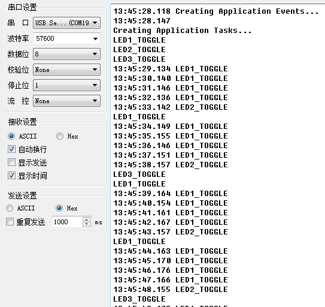