----------

#### uCosII移植STM32F407教程 ####

5/15/2019 9 :24 :23 AM 

Author :terrycoder 

----------

#### 移植环境 ####

本文所使用的移植环境如下：

硬件环境为：STM32F407VGT6
软件环境为： MDK5.23

#### 准备工作 ####

[下载源码示例](https://www.micrium.com/download/micrium_stm3240g-eval_ucos-ii/)和一个空的工程模板，至于如何创建标准库空的工程模板见[我的另外一篇教程](https://github.com/peachzz/Blog/blob/master/%E5%B5%8C%E5%85%A5%E5%BC%8F/STM32%E5%BC%80%E5%8F%91/STM32F407%E6%A0%87%E5%87%86%E5%BA%93%E6%96%B0%E5%BB%BA%E5%B7%A5%E7%A8%8B%E6%95%99%E7%A8%8B/STM32F407%E6%A0%87%E5%87%86%E5%BA%93%E6%96%B0%E5%BB%BA%E5%B7%A5%E7%A8%8B%E6%95%99%E7%A8%8B.md)

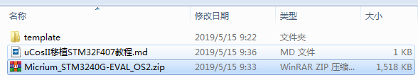

解压示例包移动源码文件

|文件名|	源文件路径|	移动路径|
| :---| :---| :---|
| cpu.h、cpu_c.c、cpu_a.asm| \Micrium\Software\uC-CPU\ARM-Cortex-M4\RealView | \Micrium\Software\uC-CPU |
| lib_mem_a.asm | \Micrium\Software\uC-LIB\Ports\ARM-Cortex-M4\RealView |\Micrium\Software\uC-LIB |
|os_cpu.h、os_cpu_a.asm、os_cpu_c.c、os_dbg.c| \Micrium\Software\uCOS-II\Ports\ARM-Cortex-M4\Generic\RealView | \Micrium\Software\uCOS-II\Ports |

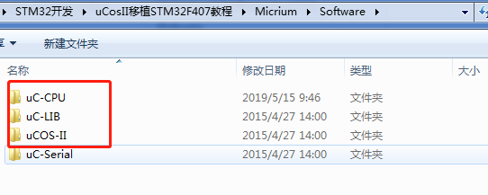

在工程模板下创建uCosII文件夹，将上图三个文件夹复制到uCosII文件夹路径下

打开工程模板，创建如下五个分组OS、uCOS-II_CPU、uCOS-II_LIB、uCOS-II_Ports、uCOS-II_Source：

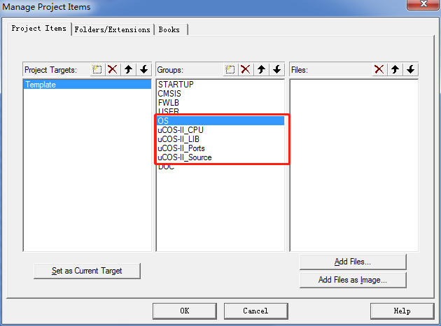

创建好分组以后，分别导入如下路径下的.C和.asm文件（和导入头文件路径也一致）：

|文件路径|
|:----|
| \template\uCOS-II\uC-CPU |
|\template\uCOS-II\uC-LIB |
|\template\uCOS-II\uCOS-II\Ports|
|\template\uCOS-II\uCOS-II\Source |

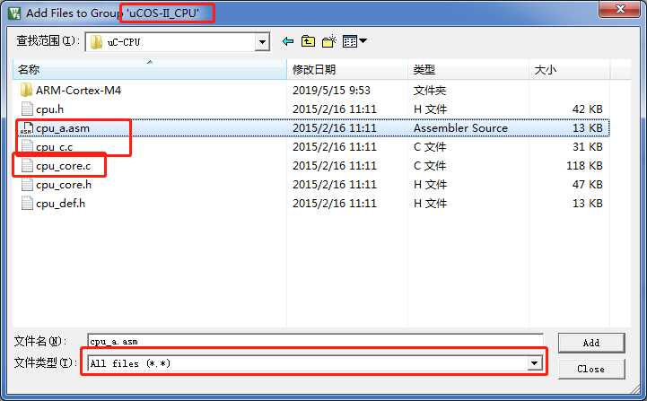

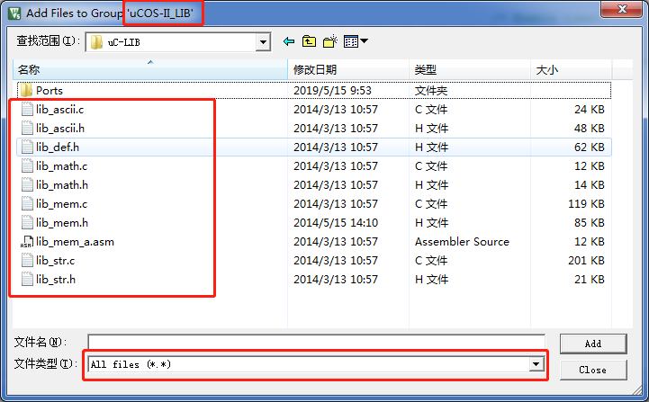

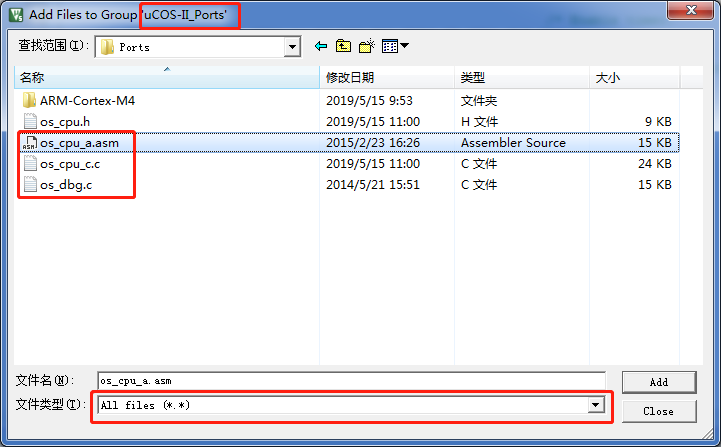

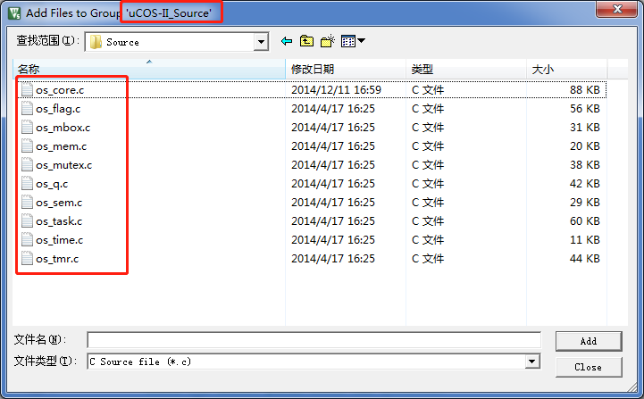

添加完所有文件源码的工程如下

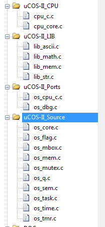

添加头文件路径

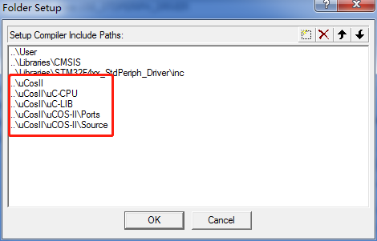

编译工程，提示缺少app_cfg.h文件，该文件在示例包\Micrium\Examples\ST\STM3240G-EVAL\OS2路径下

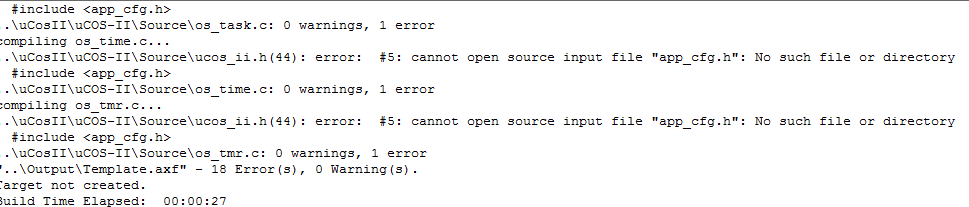

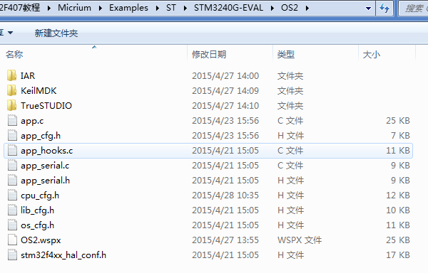

将该路径下的app_cfg.h、app_hooks.c、cpu_cfg.h、li	b_cfg.h、os_cfg.h文件复制到\template\uCOS-II\OS文件夹下，OS为新建文件夹

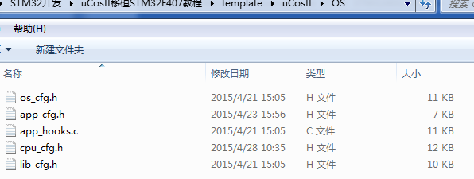

将\Micrium\Software\EvalBoards\Micrium\uC-Eval-STM32F107\BSP路径下bsp.c、bsp.h文件复制到\template\BSP文件夹下，并导入头文件到工程后编译，stm32f4xx_hal.h文件

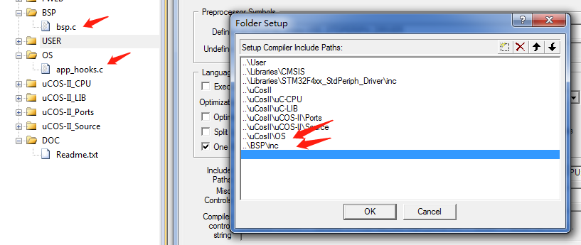

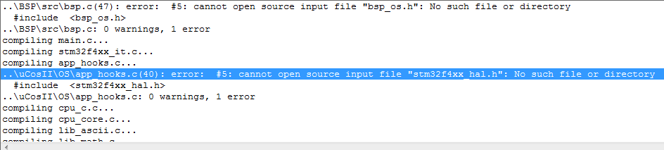

将stm32f4xx_hal.h替换为stm32f4xx.h，后再编译工程

提示没有bsp_os.h文件，注释

	//#include  <bsp_os.h>

删除bsp.c文件中除如下代码外的其他所有代码

	void  BSP_Init (void)
	CPU_INT32U  BSP_CPU_ClkFreq (void)
	//HAL_StatusTypeDef HAL_InitTick(uint32_t TickPriority)注释此函数
	void BSP_Tick_Init (void)注释此函数

在bsp.c中添加如下代码：
	
		#if (CPU_CFG_TS_TMR_EN == DEF_ENABLED)
		void  CPU_TS_TmrInit (void)
		{
		    CPU_INT32U  fclk_freq;
		
		
		    fclk_freq = BSP_CPU_ClkFreq();
		
		    BSP_REG_DEM_CR     |= (CPU_INT32U)BSP_BIT_DEM_CR_TRCENA; //ʹÓÃDWT  /* Enable Cortex-M4's DWT CYCCNT reg.                   */
		    BSP_REG_DWT_CYCCNT  = (CPU_INT32U)0u;					 //³õʼ»¯CYCCNT¼Ä´æÆ÷
		    BSP_REG_DWT_CR     |= (CPU_INT32U)BSP_BIT_DWT_CR_CYCCNTENA;//¿ªÆôCYCCNT
		
		    CPU_TS_TmrFreqSet((CPU_TS_TMR_FREQ)fclk_freq);
		}
		#endif
		
		#if (CPU_CFG_TS_TMR_EN == DEF_ENABLED)
		CPU_TS_TMR  CPU_TS_TmrRd (void)
		{
		    CPU_TS_TMR  ts_tmr_cnts;
		
		
		    ts_tmr_cnts = (CPU_TS_TMR)BSP_REG_DWT_CYCCNT;
		
		    return (ts_tmr_cnts);
		}
		#endif

删除bsp.h文件中除如下代码外的其他所有代码

	void        BSP_Init       (void);
	
	
	//CPU_INT32U  BSP_CPU_ClkFreq(void);
	
	//void        BSP_Tick_Init  (void);

接下来开始修改ucos_ii源码

注释 app_cfg.h中的 #include “cpu.h”和 void App_SerPrintf (CPU_CHAR *format, …);（136-137行）

打开文件 os_cfg.h ，修改 OS_APP_HOOKS_EN 的定义值为0（30行）；修改 OS_TICKS_PER_SEC 的定义值为 1000（51行）；修改 OS_MEM_EN 的定义值为1（98行）；修改 OS_TMR_EN 的定义值为 1（139行）；

注释os_cpu_c.c文件中（380行到386行），注释 #if (OS_CPU_ARM_FP_EN == DEF_ENABLED) 与 #endif之间的所有内容（317-354行）

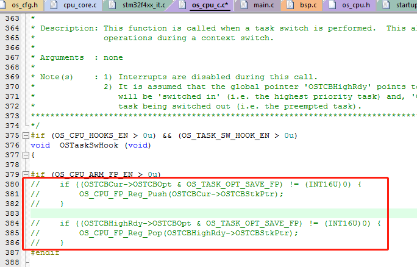

#### 注意 ####

移植完以后需要将system_stm32f4xx.s文件中以下函数进行修改

| 函数名| 修改为| 
|:--- |:--- |
|PendSV_Handler	|OS_CPU_PendSVHandler|
|SysTick_Handler|	OS_CPU_SysTickHandler|

编译工程没有提示错误

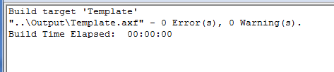

至此为止，ucos_ii的源码修改结束，接下来就是ucos_ii初始化和任务的创建。

创建任务栈

	static   OS_STK      AppTaskStartStk[APP_TASK_START_STK_SIZE];
	
	static   OS_STK      AppTaskLed1Stk[APP_TASK_LED1_STK_SIZE];
	static   OS_STK      AppTaskLed2Stk[APP_TASK_LED2_STK_SIZE];
	static   OS_STK      AppTaskLed3Stk[APP_TASK_LED3_STK_SIZE];

创建任务和时间生成函数声明

	static  void    AppTaskCreate  (void);	
	static	void	AppEventCreate (void);
	
	static  void    AppTaskStart   (void *p_arg);
	
	static  void    AppTaskLed1   (void *p_arg);
	static  void    AppTaskLed2   (void *p_arg);
	static  void    AppTaskLed3   (void *p_arg);

任务栈大小定义

	#define  APP_TASK_START_STK_SIZE                    128

	#define  APP_TASK_LED1_STK_SIZE                     128
	
	#define  APP_TASK_LED2_STK_SIZE                     128
	
	#define  APP_TASK_LED3_STK_SIZE                     128
	
	#define  APP_CFG_TASK_LED_STK_SIZE                  128

任务优先级定义

	#define  APP_TASK_START_PRIO                        4

	#define  APP_TASK_LED1_PRIO                         5
	
	#define  APP_TASK_LED2_PRIO                         6
	
	#define  APP_TASK_LED3_PRIO                         7

main函数

	int main(void)
	{
	    /* Add your application code here*/
	    CPU_INT08U  err;
	    OSInit();
	
	    OSTaskCreateExt(AppTaskStart,                               /* Create the start task                                    */
	                    (void *)0,
	                    (OS_STK *)&AppTaskStartStk[APP_TASK_START_STK_SIZE - 1],
	                    APP_TASK_START_PRIO,
	                    APP_TASK_START_PRIO,
	                    (OS_STK *)&AppTaskStartStk[0],
	                    APP_TASK_START_STK_SIZE,
	                    (void *)0,
	                    OS_TASK_OPT_STK_CHK | OS_TASK_OPT_STK_CLR);
	
	#if (OS_TASK_NAME_EN > 0)
	    OSTaskNameSet(APP_TASK_START_PRIO, "Start Task", &err);
	#endif
	
	    OSStart();
	}

启动函数创建

	static  void  AppTaskStart (void *p_arg)
	{
	    CPU_INT32U  hclk_freq;
	    CPU_INT32U  cnts;
	
	
	    (void)p_arg;
	
	    BSP_Init();                                                 /* Init BSP fncts.                                          */
	
	    CPU_Init();                                                 /* Init CPU name & int. dis. time measuring fncts.          */
	
	    hclk_freq = BSP_CPU_ClkFreq();                              /* Determine SysTick reference freq.                        */
	    cnts  = hclk_freq / (CPU_INT32U)OS_TICKS_PER_SEC;           /* Determine nbr SysTick increments in OS_TICKS_PER_SEC.    */
	    OS_CPU_SysTickInit(cnts);                                   /* Init uC/OS periodic time src (SysTick).                  */
	
	    Mem_Init();                                                 /* Init Memory Management Module.                           */
	
	#if (OS_TASK_STAT_EN > 0)
	    OSStatInit();                                               /* Determine CPU capacity                                   */
	#endif
	
	    printf(("Creating Application Events...\n\r"));
	    AppEventCreate();                                           /* Create Application Kernel objects                        */
	
	    printf(("Creating Application Tasks...\n\r"));
	    AppTaskCreate();                                            /* Create application tasks                                 */
	
	}

任务内容创建

	static  void    AppTaskLed1(void *p_arg)
	{
	
	    p_arg = p_arg;
	
	    while(DEF_TRUE)
	    {
	        printf("LED1_TOGGLE\r\n");
	        OSTimeDlyHMSM(0, 0, 1, 0);
	    }
	}
	
	static  void AppTaskLed2(void *p_arg)
	{
	
	    p_arg = p_arg;
	
	    while(DEF_TRUE)
	    {
	        printf("LED2_TOGGLE\r\n");
	        OSTimeDlyHMSM(0, 0, 5, 0);
	    }
	}
	
	static  void    AppTaskLed3(void *p_arg)
	{
	
	    p_arg = p_arg;
	
	    while(DEF_TRUE)
	    {
	        printf("LED3_TOGGLE\r\n");
	        OSTimeDlyHMSM(0, 0, 10, 0);
	    }
	}

任务创建

	static  void  AppTaskCreate (void)
	{
	    OSTaskCreateExt(AppTaskLed1,                               /* Create the Led1 task                                    */
	                    (void *)0,
	                    (OS_STK *)&AppTaskLed1Stk[APP_TASK_LED1_STK_SIZE - 1],
	                    APP_TASK_LED1_PRIO,
	                    APP_TASK_LED1_PRIO,
	                    (OS_STK *)&AppTaskLed1Stk[0],
	                    APP_TASK_LED1_STK_SIZE,
	                    (void *)0,
	                    OS_TASK_OPT_STK_CHK | OS_TASK_OPT_STK_CLR);
	
	    OSTaskCreateExt(AppTaskLed2,                               /* Create the Led2 task                                    */
	                    (void *)0,
	                    (OS_STK *)&AppTaskLed2Stk[APP_TASK_LED2_STK_SIZE - 1],
	                    APP_TASK_LED2_PRIO,
	                    APP_TASK_LED2_PRIO,
	                    (OS_STK *)&AppTaskLed2Stk[0],
	                    APP_TASK_LED2_STK_SIZE,
	                    (void *)0,
	                    OS_TASK_OPT_STK_CHK | OS_TASK_OPT_STK_CLR);
	
	    OSTaskCreateExt(AppTaskLed3,                               /* Create the Led2 task                                    */
	                    (void *)0,
	                    (OS_STK *)&AppTaskLed3Stk[APP_TASK_LED3_STK_SIZE - 1],
	                    APP_TASK_LED3_PRIO,
	                    APP_TASK_LED3_PRIO,
	                    (OS_STK *)&AppTaskLed3Stk[0],
	                    APP_TASK_LED3_STK_SIZE,
	                    (void *)0,
	                    OS_TASK_OPT_STK_CHK | OS_TASK_OPT_STK_CLR);
	}

事件创建为空

	static void AppEventCreate(void)
	{
	}

测试程序是创建了一个启动任务和用串口模式控制三个led状态翻转的任务，翻转周期分别为1s，5s，10s，运行现象如下

