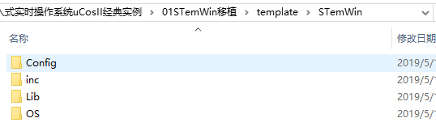
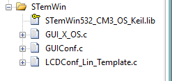
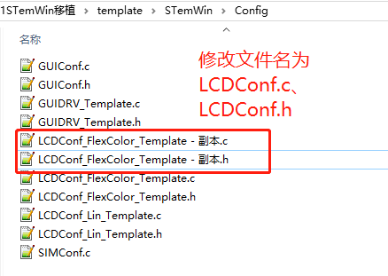
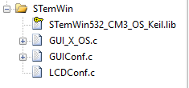
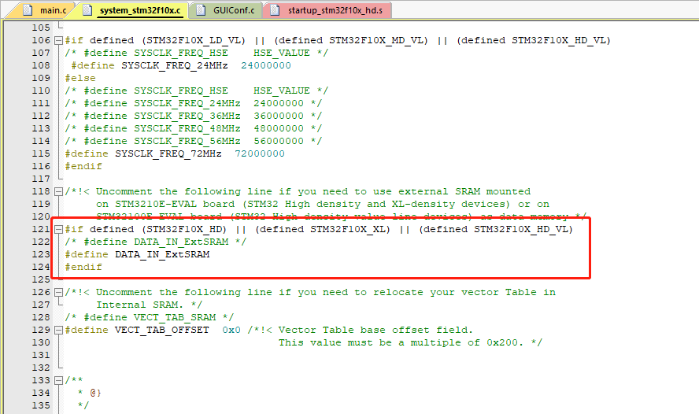
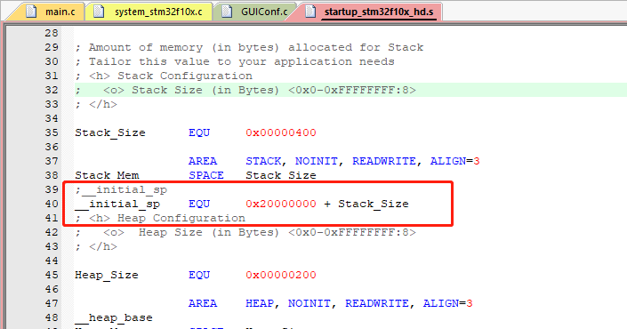
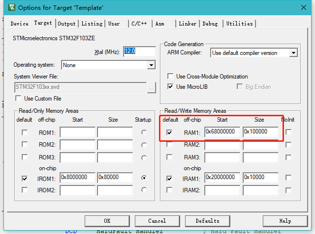
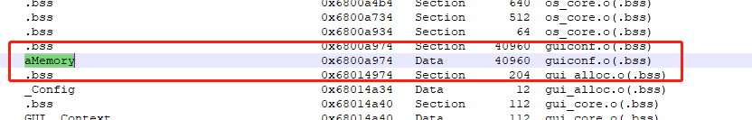

----------

#### STemWin移植 ####

2019/5/16 21 :14 :40 

Author :terrycoder

----------

#### 移植环境 ####

- win10
- MDK 5.23
- STM32F103ZET6
- STemWin_V1.2.0
- uCosII 2.92.07

#### 准备工作 ####

- STemWin资源包下载地址[下载地址](https://www.stmcu.org.cn/document/detail/index/id-214620)
- 工程模板，这里选择带有uCosII的工程

#### 开始移植 ####

在工程路径下创建STemWin文件夹，拷贝以下路径下Config、inc、Lib、OS文件夹资源库到该文件下，

|目标|路径|
|:---|:---|
|Config、inc、Lib、OS|\STemWin_Library_V1.2.0\Libraries\STemWinLibrary532|

打开\template\STemWin\Lib文件夹，由于我使用的是M3内核带操作系统的模板，所以选择STemWin532_CM3_OS_Keil.lib库，如果是不带操作系统则选择STemWin532_CM3_Keil.lib库，其余三个文件夹不用改变

#### 导入源码 ####

创建STemWin分组，导入如下文件

复制Config文件下的LCDConf_FlexColor_Template.c、LCDConf_FlexColor_Template.h修改文件名为LCDConf.c、LCDConf.h，删除工程中的LCDConf_FlexColor_Template.c，重新导入LCDConf.c

**注意**

**实际移植过程发现STemWin532_CM3_OS_Keil.lib库不能使用，使用的是keil安装目录下\Keil_v5\ARM\PACK\Keil\MDK-Middleware\7.4.0\emWin\Lib\ARM路径下的GUI_CM3_L.lib库文件，并且编译等级不能使用小于1级以上编译工程，否则屏幕不能正常显示。**

打开LCDConf.c文件，添加LCD驱动文件#include "bsp_lcd.h"，然后修改如下代码

	#define XSIZE_PHYS  240 // To be adapted to x-screen size
	#define YSIZE_PHYS  320 // To be adapted to y-screen size
修改为

	#define XSIZE_PHYS  LCD_DEFAULT_WIDTH // To be adapted to x-screen size //第67行
	#define YSIZE_PHYS  LCD_DEFAULT_HEIGTH // To be adapted to y-screen size//第68行

添加如下代码

	#define TOUCH_AD_TOP 	 			  226    //YPhys0 //第71到74行
	#define TOUCH_AD_BOTTOM  			  3854    //YPhys1
	#define TOUCH_AD_LEFT 	 			3780    //XPhys0
	#define TOUCH_AD_RIGHT 	 			250    //XPhys1	

	#define DISPLAY_ORIENTATION (0)    //第77行
     
	#ifndef   DISPLAY_ORIENTATION	   //第111行
	  #define DISPLAY_ORIENTATION 0
	#endif

	static void LcdWriteReg(U16 Data) {
  	// ... TBD by user
    LCD_WRITE_CMD(Data);	
	}

	static void LcdWriteData(U16 Data) {
 	 // ... TBD by user
    LCD_WRITE_DATA(Data);	
	}

	static void LcdWriteDataMultiple(U16 * pData, int NumItems) {
	  while (NumItems--) {
	    // ... TBD by user
	      LCD_WRITE_DATA(*pData++); 	 
	  }
	}

	static void LcdReadDataMultiple(U16 * pData, int NumItems) {
	  while (NumItems--) {
	    // ... TBD by user
	       *pData++ = LCD_READ_DATA();
	  }
	}

	void LCD_X_Config(void) {
	  GUI_DEVICE * pDevice;
	  GUI_PORT_API PortAPI = {0};
	  CONFIG_FLEXCOLOR Config = {0};
	
	  //
	  // Set display driver and color conversion for 1st layer
	  //
	  pDevice = GUI_DEVICE_CreateAndLink(DISPLAY_DRIVER, COLOR_CONVERSION, 0, 0);
	  //
	  // Display driver configuration
	  //
	  if (DISPLAY_ORIENTATION & GUI_SWAP_XY) {
	    LCD_SetSizeEx (0, YSIZE_PHYS,   XSIZE_PHYS);
	    LCD_SetVSizeEx(0, VYSIZE_PHYS,  VXSIZE_PHYS);
	  } else {
	    LCD_SetSizeEx (0, XSIZE_PHYS,   YSIZE_PHYS);
	    LCD_SetVSizeEx(0, VXSIZE_PHYS,  VYSIZE_PHYS);
	  }
	  //
	  // Orientation
	  //
	  Config.FirstCOM = 0;									      
	  Config.FirstSEG = 0; 									      
	  Config.Orientation = DISPLAY_ORIENTATION;		
	  Config.NumDummyReads = 2;								    
	  GUIDRV_FlexColor_Config(pDevice, &Config);
	  //
	  // Set controller and operation mode
	  //
	  PortAPI.pfWrite16_A0  = LcdWriteReg;
	  PortAPI.pfWrite16_A1  = LcdWriteData;
	  PortAPI.pfWriteM16_A1 = LcdWriteDataMultiple;
	  PortAPI.pfReadM16_A1  = LcdReadDataMultiple;
	  GUIDRV_FlexColor_SetFunc(pDevice, &PortAPI, GUIDRV_FLEXCOLOR_F66709, GUIDRV_FLEXCOLOR_M16C0B16);
	  
	//  
	//  GUI_TOUCH_SetOrientation((GUI_MIRROR_X * LCD_GetMirrorXEx(0)) |
	//              (GUI_MIRROR_Y * LCD_GetMirrorYEx(0)) |
	//              (GUI_SWAP_XY  * LCD_GetSwapXYEx (0)));
	//  
	//  GUI_TOUCH_Calibrate(GUI_COORD_X, 0, XSIZE_PHYS-1, TOUCH_AD_RIGHT ,TOUCH_AD_LEFT );
	//  GUI_TOUCH_Calibrate(GUI_COORD_Y, 0, YSIZE_PHYS-1,TOUCH_AD_BOTTOM ,TOUCH_AD_TOP );
	
	}

	int LCD_X_DisplayDriver(unsigned LayerIndex, unsigned Cmd, void * pData)
	{
	    int r;
	     (void) LayerIndex;
	     (void) pData;
	     switch (Cmd) {
	     case LCD_X_INITCONTROLLER: {
	     //
	     // Called during the initialization process in order to set up the
	     // display controller and put it into operation. If the display
	     // controller is not initialized by any external routine this needs
	     // to be adapted by the customer...
	     //
	     // ...
	    return 0;
	    }
	    default:
	     r = -1;
	    }
	     return r;
	}

然后打开GUIConf.c文件，修改如下代码：

	#define GUI_NUMBYTES  0x200000 // 第56行 
修改为
	#define GUI_NUMBYTES  20*1024u

在GUIConf.h文件中添加：

	#define OS_SUPPORT

在bsp.h头文件中添加

    #include "GUI.h"
    #include "DIALOG.h"

接着打开GUI_X_OS.c文件：

	#include "includes.h"

	static  OS_EVENT *DispSem;
	//static  OS_EVENT *EventSem;
	static OS_EVENT *EventMbox; //消息邮箱
	
	static  OS_EVENT *KeySem;
	static  int     KeyPressed;
	static  char    KeyIsInited;

	int GUI_X_GetTime(void)
	{
	    return ((INT32U)OSTimeGet());
	}
	
	void GUI_X_Delay(int ms)
	{
	    INT32U ticks;
	    ticks = (ms * 1000) / OS_TICKS_PER_SEC; 
	    OSTimeDly(ticks);
	}

	void GUI_X_ExecIdle(void)
	{
	    GUI_X_Delay(1);
	}

	void GUI_X_InitOS(void)
	{
	    /* 用于资源共享 cnt = 1*/
	    DispSem =  OSSemCreate((INT16U)1);
	//    /* 用于时间触发 cnt = 0*/
	//    EventSem = OSSemCreate((INT16U)0);
	    EventMbox = OSMboxCreate((void*)0); //´´½¨ÏûÏ¢ÓÊÏä
	}
	
	
	
	void GUI_X_Lock(void)
	{
	    INT8U err;
	    OSSemPend((OS_EVENT *)DispSem,
	              (INT32U )0,
	              (INT8U *)&err);
	}
	
	void GUI_X_Unlock(void)
	{
	    OSSemPost((OS_EVENT *)DispSem);
	}
	
	/* Get Task handle */
	U32 GUI_X_GetTaskId(void)
	{
	    return ((INT8U)(OSTCBCur->OSTCBPrio));
	}
	
	
	void GUI_X_WaitEvent (void)
	{
	    INT8U err;
	    OSMboxPend((OS_EVENT *)EventMbox,
	              (INT32U )0,
	              (INT8U *)&err);
	}
	
	
	void GUI_X_SignalEvent (void)
	{
	    OSMboxPost((OS_EVENT *) EventMbox,(void *)1);
	}
	
	static  void  CheckInit (void)
	{
	    if (KeyIsInited == DEF_FALSE)
	    {
	        KeyIsInited = DEF_TRUE;
	        GUI_X_Init();
	    }
	}

	void GUI_X_Init(void)
	{
	    KeySem = OSSemCreate((INT16U)0);
	}
	
	int  GUI_X_GetKey (void)
	{
	    int r;
	
	    r          = KeyPressed;
	    CheckInit();
	    KeyPressed = 0;
	    return (r);
	}
	
	int  GUI_X_WaitKey (void)
	{
	    int    r;
	    INT8U err;
	
	    CheckInit();
	    if (KeyPressed == 0)
	    {
	        OSSemPend((OS_EVENT *)KeySem,
	                  (INT32U )0,
	                  (INT8U *)&err);
	    }
	    r          = KeyPressed;
	    KeyPressed = 0;
	    return (r);
	}
	
	void  GUI_X_StoreKey (int k)
	{
	    KeyPressed = k;
	    OSSemPost((OS_EVENT *)KeySem);
	}

最后配置一下GUIConf.h文件

	#ifndef GUICONF_H
	#define GUICONF_H
	
	/*********************************************************************
	*
	*       Multi layer/display support
	*/
	#define GUI_NUM_LAYERS            2    // Maximum number of available layers
	
	/*********************************************************************
	*
	*       Multi tasking support
	*/
	#define OS_SUPPORT			//使用操作系统
	#ifdef OS_SUPPORT
	 #define GUI_OS                    (1)  // Compile with multitasking support
	#else
	 #define GUI_OS                    (0)
	#endif
	
	/*********************************************************************
	*
	*       Configuration of touch support
	*/
	#ifndef   GUI_SUPPORT_TOUCH
	  #define GUI_SUPPORT_TOUCH       (0)  // Support touchscreen
	#endif
	
	/*********************************************************************
	*
	*       Default font
	*/
	#define GUI_DEFAULT_FONT          &GUI_Font6x8
	
	/*********************************************************************
	*
	*         Configuration of available packages
	*/
	#define GUI_SUPPORT_MOUSE             (1)    /* Support a mouse */
	#define GUI_WINSUPPORT                (1)    /* Use window manager */
	#define GUI_SUPPORT_MEMDEV            (1)    /* Memory device package available */
	#define GUI_SUPPORT_DEVICES           (1)    /* Enable use of device pointers */
	
	#endif  /* Avoid multiple inclusion */

最后在main.c中初始化

	static  void  AppTaskStart (void *p_arg)
	{
	
	    (void)p_arg;
	
	    BSP_Init();                                                 /* Init BSP fncts.                                          */
	
	    CPU_Init();                                                 /* Init CPU name & int. dis. time measuring fncts.          */
	
	//    hclk_freq = BSP_CPU_ClkFreq();                              /* Determine SysTick reference freq.                        */
	//    cnts  = hclk_freq / (CPU_INT32U)OS_TICKS_PER_SEC;           /* Determine nbr SysTick increments in OS_TICKS_PER_SEC.    */
	//    OS_CPU_SysTickInit(cnts);                                   /* Init uC/OS periodic time src (SysTick).                  */
	
	    Mem_Init();                                                 /* Init Memory Management Module.                           */
	
	#if (OS_TASK_STAT_EN > 0)
	    OSStatInit();                                               /* Determine CPU capacity                                   */
	#endif
	
	#if (APP_CFG_SERIAL_EN == DEF_ENABLED)                          /* Init serial port 0 to 115,2000 baud for use  with  ...   */
	    //    BSP_Ser_Init(115200);                                       /* ... tracing. See app_cfg.h.                              */
	#endif
	
	
	    printf(("Creating Application Events...\n\r"));
	    AppEventCreate();                                           /* Create Application Kernel objects                        */
	
	    printf(("Creating Application Tasks...\n\r"));
	    AppTaskCreate();                                            /* Create application tasks                                 */
	
	
	
	    //    while (DEF_TRUE)                                            /* Task body, always written as an infinite loop.           */
    //    {
    //        OSTimeDlyHMSM(0, 0, 0, 100);
    //    }
	}

	//测试任务
	static  void    AppTaskLed3(void *p_arg)
	{
	
	    p_arg = p_arg;
	    uint16_t i=0;
	    
	    GUI_SetBkColor(GUI_RED);
	    GUI_Clear();
	    
	    GUI_SetColor(GUI_BLUE);
	    GUI_SetFont(GUI_FONT_20B_ASCII);
		GUI_DispStringAt("YS-F1Pro board STemWin test!",10,10);
		GUI_Delay(10);
	    LCD_BK_ON();
	    while(DEF_TRUE)
	    {
	        GUI_DispDecAt(i++,100,40,4);
	        if(i>9999) i=0; 
	        if(i%100 == 0)
	        {
	            printf("AppTaskLed3 is run %d\r\n",i);
	        }
	        OSTimeDlyHMSM(0, 0, 0, 50);
	    }
	}

	//初始化硬件外设需要使能CRC  STemWin库需要
	void  BSP_Init (void)
	{
	    RCC_AHBPeriphClockCmd(RCC_AHBPeriph_CRC, ENABLE);
	    NVIC_Configuration(); 
	    
		LED_GPIO_Init();
	    
		DEBUG_USART_Init();
	    SysTick_Init();
	    BSP_LCD_Init();
	    BSP_Tick_Init();
	    GUI_Init(); // 初始化GUI
	}

编译工程后下载程序，可以看到程序正常运行

移植总结：

- 导入源码，LCD驱动等
- 修改GUIConf.c,LCDConf.c，GUI_X_OS.c文件，配置GUIConf.h
- 编写测试程序

|文件名|修改部分|内容|
|---|---|
|GUIConf.c|GUI可用字节数|#define GUI_NUMBYTES  20*1024u|
|GUIConf.c|分配内存|void GUI_X_Config(void)|
|LCDConf.c|屏幕显示尺寸|#define XSIZE_PHYS    LCD_DEFAULT_WIDTH 、#define XSIZE_PHYS    LCD_DEFAULT_WIDTH |
|LCDConf.c|数据、命令函数|void LcdWriteReg(U16 Data)、void LcdWriteData(U16 Data)、int LCD_X_DisplayDriver(unsigned LayerIndex, unsigned Cmd, void * pData)|
|LCDConf.c|LCD配置|void LcdWriteDataMultiple(U16 * pData, int NumItems)、void LcdReadDataMultiple(U16 * pData, int NumItems) 、void LCD_X_Config(void) |
|GUI_X_OS.c|消息邮箱和信号量定义和实现|OS_EVENT \*DispSem;OS\_EVENT \*EventMbox;OS_EVENT \*KeySem;|
|GUIConf.h|配置GUI|根据工程环境配置|

----------

#### 使用外部RAM相关配置 ####

移植完以后发现GUIConf.c文件中GUI_NUMBYTES的不能设置太大，否则会报编译错误，所以可以考虑使用外部RAM，不用担心内存不够编译错误了。

	#define GUI_NUMBYTES  40*1024u //0x200000

首先打开system_stm32f10x.c文件在122行定义宏DATA_IN_ExtSRAM，注意STM32F103默认配置的是FSMC的块1RAM3，如果外部RAM在别的块需要在SystemInit_ExtMemCtl中重新定义块地址，

	#define DATA_IN_ExtSRAM

第二步在启动文件startup_stm32f10x_hd.s文件中修改第39行为：

	__initial_sp    EQU     0x20000000 + Stack_Size  

最后一步在工程中设置外部RAM的起始地址和大小，重新编译工程就可以使用外部RAM了。

可以看到aMemory使用的外部的RAM。

