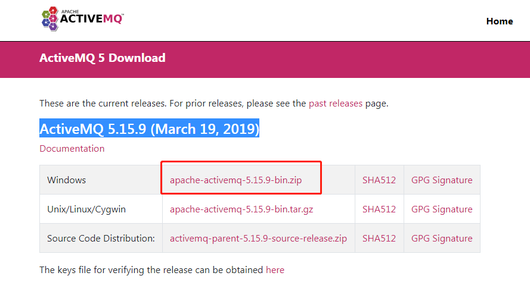
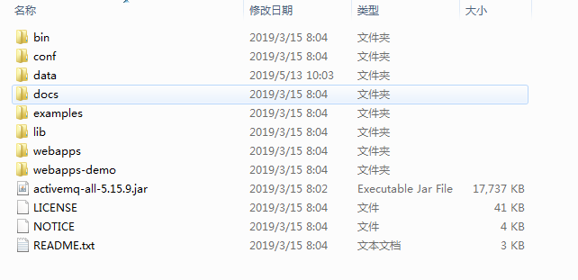
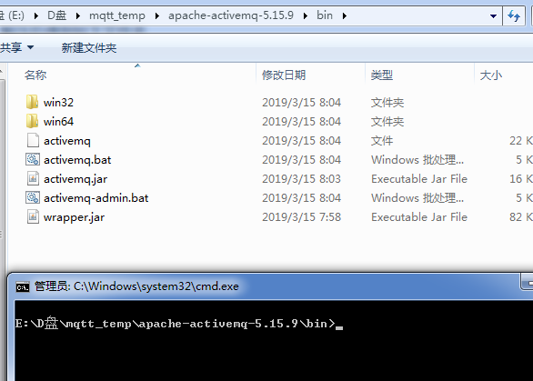
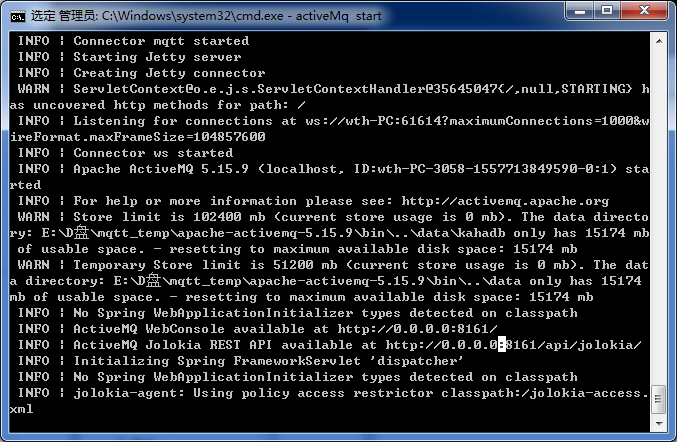
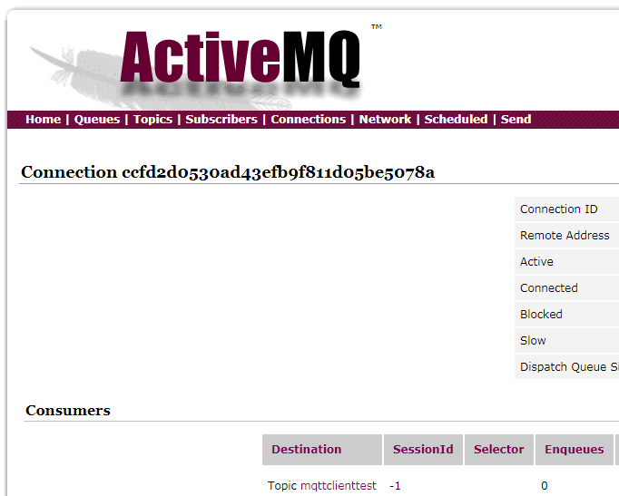

----------

### MQTT服务器搭建 ###

5/13/2019 10 :43 :27 AM 

----------

#### 安装环境 ####

win7 64位系统

运行ActiveMQ需要Java运行环境，需要自行配置Java环境

#### 下载ActiveMQ安装包 ####

最新版本的ActiveMQ已经可以免安装直接运行了[点击下载](http://activemq.apache.org/components/classic/download/)

下载完成以后安装包如下：

解压安装包：

在此文件夹路径下打开命令行：

输入activeMq start

> activeMq start

运行后显示如下界面运行成功：

打开浏览器输入 

>http://localhost:8161/admin/

输入默认账号和密码：admin

进入界面如下

到此MQTT服务器搭建已经完成

出现问题

按安装过程中执行activeMq start后命令行显示“wapper stop”错误不能正常运行ActiveMQ，解决办法：

1.确认计算机主机名名称没有下划线；
2.如果是win7，停止ICS(运行-->services.msc找到Internet Connection Sharing (ICS)服务,改成手动启动或禁用)
